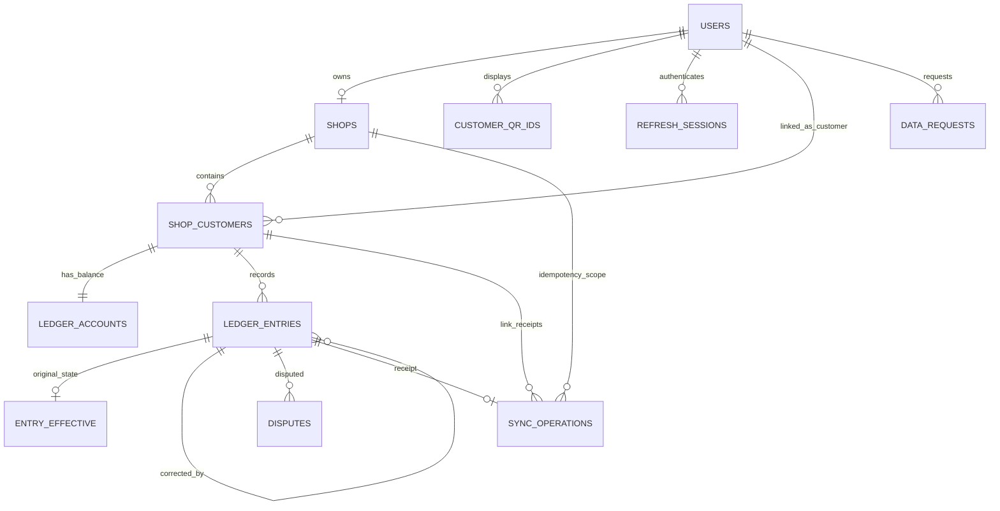

# Udhaar Khata — Database Design / ERD

<!-- DOC_NAV_START -->
> **Document map:** [Document map](DOCUMENT-MAP.md). **Read with:** [LLD](LLD.md) · [API specification](API-SPECIFICATION.md) · [Security requirements](SECURITY-REQUIREMENTS.md) · [QA cases](TEST-CASES-QA-CHECKLIST.md).
<!-- DOC_NAV_END -->

**Version:** 1.0 draft  
**Date:** 29 September 2026  
**Release:** Android v1  
**Status:** Design specification; migration SQL and application code are not yet implemented  
**Baseline:** [SRS](SRS.md) · [SES](SES.md) · [HLD](HLD.md) · [LLD](LLD.md)

## 1. Purpose and storage boundaries

Cloudflare D1 is authoritative for **acknowledged** users, shops, customer links, ledger entries, disputes and operation outcomes. The Flutter app uses account-scoped SQLite for cached views and a durable offline outbox. Only the Worker reads or writes D1; a device never receives a D1 credential. A local Pending entry is provisional and may be lost with the phone before upload. A new phone restores only D1-acknowledged data.

This document fixes the logical schema, keys, constraints, concurrency approach, query shapes and migration/verification requirements. The DDL below is an implementation blueprint, not a claim that a production migration has been run. All money is **integer paise**; all timestamps are UTC epoch milliseconds (`INTEGER`) except a due date, which is a calendar date (`YYYY-MM-DD`). IDs are opaque strings unless stated otherwise. A single D1 database serves the v1 tenant population, so every financial query must include a shop/customer scope. Financial data never uses email, name or QR ID as a join key.

## 2. Entity relationship diagram



`ledger_accounts` and `entry_effective` are rebuildable projections. `ledger_entries` is the financial source of truth. `sync_operations` preserves exact response identity for retried mutations. FKs prevent dangling references; application authorization remains mandatory because foreign keys do not enforce who may read or write a row.

## 3. Keys, types and core tables

The Worker generates opaque IDs for users, shops, links, entries, disputes and requests. A client generates a UUID v4 `client_operation_id` once, before committing its local outbox record. D1 stores UUIDs as canonical text and validates shape in the Worker. `server_seq` is an increasing D1 integer primary key used for stable pagination and pull cursors; it is not a per-customer invoice number. The app must never infer that a gap in the sequence means data is missing from its authorized ledger.

The table definitions show required columns and database-level constraints. Defaults and field-size limits must be finalized with the API and Security documents before the first migration. The Worker also validates all strings and amount bounds before SQL execution.

```sql
CREATE TABLE users (
  id TEXT PRIMARY KEY,
  google_sub TEXT NOT NULL UNIQUE,
  account_role TEXT NOT NULL CHECK (account_role IN ('owner','customer')),
  display_name TEXT NOT NULL,
  email TEXT,
  created_at_ms INTEGER NOT NULL,
  deleted_at_ms INTEGER
);

CREATE TABLE customer_qr_ids (
  public_id TEXT PRIMARY KEY,
  customer_user_id TEXT NOT NULL REFERENCES users(id) ON DELETE RESTRICT,
  status TEXT NOT NULL CHECK (status IN ('active','revoked')),
  created_at_ms INTEGER NOT NULL,
  revoked_at_ms INTEGER,
  CHECK ((status = 'active' AND revoked_at_ms IS NULL) OR
         (status = 'revoked' AND revoked_at_ms IS NOT NULL))
);
CREATE UNIQUE INDEX uq_one_active_qr_per_customer
  ON customer_qr_ids(customer_user_id) WHERE status = 'active';

CREATE TABLE shops (
  id TEXT PRIMARY KEY,
  owner_user_id TEXT NOT NULL UNIQUE REFERENCES users(id) ON DELETE RESTRICT,
  name TEXT NOT NULL CHECK (length(trim(name)) > 0),
  status TEXT NOT NULL CHECK (status IN ('active','closed')),
  created_at_ms INTEGER NOT NULL,
  closed_at_ms INTEGER
);

CREATE TABLE shop_customers (
  id TEXT PRIMARY KEY,
  shop_id TEXT NOT NULL REFERENCES shops(id) ON DELETE RESTRICT,
  customer_user_id TEXT NOT NULL REFERENCES users(id) ON DELETE RESTRICT,
  shop_nickname TEXT,
  status TEXT NOT NULL CHECK (status IN ('active','access_removed')),
  linked_at_ms INTEGER NOT NULL,
  access_removed_at_ms INTEGER,
  UNIQUE (shop_id, customer_user_id),
  UNIQUE (id, shop_id, customer_user_id)
);

CREATE TABLE ledger_accounts (
  shop_customer_id TEXT PRIMARY KEY REFERENCES shop_customers(id) ON DELETE RESTRICT,
  balance_paise INTEGER NOT NULL DEFAULT 0 CHECK (balance_paise >= 0),
  version INTEGER NOT NULL DEFAULT 0 CHECK (version >= 0),
  updated_at_ms INTEGER NOT NULL
);

CREATE TABLE ledger_entries (
  server_seq INTEGER PRIMARY KEY AUTOINCREMENT,
  id TEXT NOT NULL UNIQUE,
  shop_customer_id TEXT NOT NULL REFERENCES shop_customers(id) ON DELETE RESTRICT,
  shop_id TEXT NOT NULL,
  customer_user_id TEXT NOT NULL,
  kind TEXT NOT NULL CHECK (kind IN ('credit','payment','correction')),
  amount_paise INTEGER,
  target_amount_paise INTEGER,
  effect_paise INTEGER NOT NULL,
  note TEXT,
  payment_method TEXT CHECK (payment_method IN ('cash','upi')),
  due_date TEXT,
  corrects_entry_id TEXT REFERENCES ledger_entries(id) ON DELETE RESTRICT,
  expected_revision INTEGER,
  correction_reason TEXT,
  created_by_user_id TEXT NOT NULL REFERENCES users(id) ON DELETE RESTRICT,
  client_operation_id TEXT NOT NULL,
  device_id TEXT,
  occurred_at_ms INTEGER NOT NULL,
  created_at_ms INTEGER NOT NULL,
  FOREIGN KEY (shop_customer_id, shop_id, customer_user_id)
    REFERENCES shop_customers(id, shop_id, customer_user_id),
  UNIQUE (shop_id, client_operation_id),
  CHECK (
    (kind = 'credit' AND amount_paise > 0 AND target_amount_paise IS NULL
      AND effect_paise = amount_paise AND payment_method IS NULL
      AND corrects_entry_id IS NULL AND expected_revision IS NULL
      AND correction_reason IS NULL)
    OR
    (kind = 'payment' AND amount_paise > 0 AND target_amount_paise IS NULL
      AND effect_paise = -amount_paise AND payment_method IS NOT NULL
      AND due_date IS NULL AND corrects_entry_id IS NULL
      AND expected_revision IS NULL AND correction_reason IS NULL)
    OR
    (kind = 'correction' AND amount_paise IS NULL AND target_amount_paise >= 0
      AND payment_method IS NULL AND due_date IS NULL
      AND corrects_entry_id IS NOT NULL AND expected_revision >= 0
      AND length(trim(correction_reason)) > 0)
  )
);

CREATE TABLE entry_effective (
  entry_id TEXT PRIMARY KEY REFERENCES ledger_entries(id) ON DELETE RESTRICT,
  shop_customer_id TEXT NOT NULL REFERENCES shop_customers(id) ON DELETE RESTRICT,
  effective_paise INTEGER NOT NULL,
  revision INTEGER NOT NULL DEFAULT 0 CHECK (revision >= 0)
);

CREATE TABLE sync_operations (
  shop_id TEXT NOT NULL REFERENCES shops(id) ON DELETE RESTRICT,
  client_operation_id TEXT NOT NULL,
  operation_kind TEXT NOT NULL CHECK (operation_kind IN ('link','entry')),
  request_hash TEXT NOT NULL,
  entry_id TEXT UNIQUE REFERENCES ledger_entries(id) ON DELETE RESTRICT,
  shop_customer_id TEXT REFERENCES shop_customers(id) ON DELETE RESTRICT,
  response_version INTEGER,
  response_balance_paise INTEGER,
  created_at_ms INTEGER NOT NULL,
  PRIMARY KEY (shop_id, client_operation_id),
  CHECK ((operation_kind = 'entry' AND entry_id IS NOT NULL AND shop_customer_id IS NULL
           AND response_version IS NOT NULL AND response_balance_paise IS NOT NULL)
      OR (operation_kind = 'link' AND entry_id IS NULL AND shop_customer_id IS NOT NULL))
);
```

The effective value is nonnegative for an original credit and nonpositive for an original payment. Enforce its sign, magnitude and relationship to the original kind in the trigger logic below.

An owner account and customer account have one role each in v1. If product decisions later permit one Google identity to play both roles, replace `account_role` with an explicit role-membership model before data is created; do not duplicate `google_sub` or infer role from the presence of a shop. Application code must check that `customer_qr_ids.customer_user_id` and `shop_customers.customer_user_id` reference a customer role, and `shops.owner_user_id` references an owner role. The simple foreign keys above cannot express these cross-table role checks.

### 3.1 Disputes, sessions and privacy requests

```sql
CREATE TABLE disputes (
  id TEXT PRIMARY KEY,
  entry_id TEXT NOT NULL REFERENCES ledger_entries(id) ON DELETE RESTRICT,
  shop_customer_id TEXT NOT NULL REFERENCES shop_customers(id) ON DELETE RESTRICT,
  customer_user_id TEXT NOT NULL REFERENCES users(id) ON DELETE RESTRICT,
  reason TEXT NOT NULL CHECK (length(trim(reason)) > 0),
  status TEXT NOT NULL CHECK (status IN ('open','resolved')),
  owner_note TEXT,
  created_at_ms INTEGER NOT NULL,
  resolved_at_ms INTEGER,
  resolved_by_user_id TEXT REFERENCES users(id) ON DELETE RESTRICT,
  CHECK ((status = 'open' AND resolved_at_ms IS NULL AND resolved_by_user_id IS NULL)
      OR (status = 'resolved' AND resolved_at_ms IS NOT NULL AND resolved_by_user_id IS NOT NULL))
);
CREATE UNIQUE INDEX uq_one_open_dispute_per_entry
  ON disputes(entry_id, customer_user_id) WHERE status = 'open';

CREATE TABLE refresh_sessions (
  id TEXT PRIMARY KEY,
  user_id TEXT NOT NULL REFERENCES users(id) ON DELETE RESTRICT,
  device_id TEXT NOT NULL,
  token_hash TEXT NOT NULL UNIQUE,
  created_at_ms INTEGER NOT NULL,
  expires_at_ms INTEGER NOT NULL,
  revoked_at_ms INTEGER,
  CHECK (expires_at_ms > created_at_ms)
);

CREATE TABLE data_requests (
  id TEXT PRIMARY KEY,
  requester_user_id TEXT NOT NULL REFERENCES users(id) ON DELETE RESTRICT,
  request_kind TEXT NOT NULL CHECK (request_kind IN ('export','account_deletion','shop_deletion','access_removal')),
  scope_shop_id TEXT REFERENCES shops(id) ON DELETE RESTRICT,
  status TEXT NOT NULL CHECK (status IN ('submitted','in_review','completed','denied')),
  created_at_ms INTEGER NOT NULL,
  resolved_at_ms INTEGER,
  resolution_note TEXT
);
```

The earlier SES called the last table `deletion_requests`; this design broadens it to `data_requests` because v1 also tracks export and access-removal requests. The API document should use this table name. A dispute's `entry_id`, `shop_customer_id` and `customer_user_id` must agree; enforce this through a composite reference or an insert trigger, plus an authenticated customer query. A resolved dispute is not a ledger adjustment. Access removal changes viewing rights according to the published policy, not the immutable financial history.

## 4. Ledger invariants and atomic write pattern

The following invariants must hold at each committed D1 state:

1. Every posted original entry belongs to one active, authorized shop/customer link at commit time, and its creator is that shop's owner.
2. Credit effect is `+amount_paise`; payment effect is `−amount_paise`. A correction references an original credit or payment in the **same** ledger, and `effect_paise = new_effective_contribution − old_effective_contribution`.
3. A correction's `expected_revision` matches the current original's `entry_effective.revision`. The first correction expects zero. Each successful correction increments it once.
4. `ledger_accounts.balance_paise` is never negative and equals `SUM(ledger_entries.effect_paise)` for that `shop_customer_id`. `version` increases once per posted ledger entry.
5. One `(shop_id, client_operation_id)` yields one original committed result. A retry with the same canonical request hash receives that result; a changed hash is rejected.
6. Ledger rows and sync receipts are immutable in normal app routes. Product cancellation uses another correction; deletion uses an approved administrative/retention workflow only.

**Required implementation approach:** use D1-supported SQL triggers for same-transaction assertions and projection updates, then use a transactional prepared-statement `batch()` for the entry insert and its `sync_operations` receipt. A batch containing a failed statement rolls back. A pre-read in Worker code is useful for an error message but is never the only balance or revision guard. Before implementing, test the exact trigger and batch behavior on the pinned D1 runtime; SQL snippets here specify the checks rather than pretending a single untested query is sufficient.

The entry insert guard must reject with `RAISE(ABORT, ...)` when: shop/link is inactive; creator is not the shop owner; original kind/target mismatches; correction points to a correction or another ledger; expected revision is stale; `effect_paise` differs from computed target delta; an amount is outside the approved bounds; or `ledger_accounts.balance_paise + effect_paise < 0`. The effect calculation and guard run inside the same committed SQL operation. An after-insert trigger updates `ledger_accounts` and, for an original, creates `entry_effective`; for a correction, it changes `entry_effective.effective_paise` and increments revision. Check trigger order and rollback using tests, and do not allow a direct `UPDATE` or `DELETE` of posted entries through the Worker.

For example, a ₹500 credit writes `+50000`. Correcting it to ₹450 at revision 0 writes a correction `effect_paise = −5000`, `target_amount_paise = 45000`, then advances revision to 1. A repeated correction to ₹400 at revision 1 writes `−5000`, not `−10000`. Another concurrent revision-1 correction must fail. Correcting a payment to ₹0 restores what that payment had subtracted; the original payment row remains. Reducing a credit below amounts already paid may make the ledger negative; reject that correction and require an explicit owner resolution path rather than create an advance.

For a new link, enforce a unique `(shop_id, customer_user_id)` and insert the link, its zero `ledger_accounts` row and optional link-operation receipt in one transactional batch. Existing link scan returns the same link. A revoked QR cannot authorize a **new** link. A QR rotation does not delete existing links. Link idempotency uses the same operation-key/hash behavior as posting. A failed first-time link must leave no orphan ledger account or receipt.

All production migrations must be tested from an empty database and from the previous version before deployment.

## 5. Indexes and query contracts

```sql
CREATE INDEX ix_qr_customer ON customer_qr_ids(customer_user_id, status);
CREATE INDEX ix_links_customer ON shop_customers(customer_user_id, status, shop_id);
CREATE INDEX ix_links_shop ON shop_customers(shop_id, status, id);
CREATE INDEX ix_entries_ledger_seq ON ledger_entries(shop_customer_id, server_seq);
CREATE INDEX ix_entries_shop_seq ON ledger_entries(shop_id, server_seq);
CREATE INDEX ix_entries_correction_target ON ledger_entries(corrects_entry_id);
CREATE INDEX ix_disputes_ledger_status ON disputes(shop_customer_id, status, created_at_ms);
CREATE INDEX ix_sessions_user ON refresh_sessions(user_id, revoked_at_ms, expires_at_ms);
CREATE INDEX ix_requests_user ON data_requests(requester_user_id, created_at_ms);
```

Primary/unique keys already index Google subject, QR public ID, owner ID, `(shop_id, customer_user_id)` and `(shop_id, client_operation_id)`. Remove redundant indexes after checking `EXPLAIN QUERY PLAN` and measured D1 row reads/writes; each index consumes storage and adds write cost. Required query shapes:

| Query | Filter and order | Access rule |
|---|---|---|
| Resolve QR | Exact `public_id`, `status='active'` | Rate limited; return minimal label only. |
| Owner customer list | `shop_id`, active links, bounded page | Shop owner from session. |
| Owner/customer ledger | `shop_customer_id`, `server_seq > cursor`, ascending, limit | Owner owns shop or authenticated customer owns link. |
| Retry receipt | Exact `(shop_id, client_operation_id)` | Owner plus same request hash. |
| Correction state | Exact original `entry_id`, same `shop_customer_id` | Owner of shop. |
| Date-range statement | Ledger and event-time range, ordered `occurred_at_ms, server_seq` | Same scoped authorization; compute opening from all earlier effects. |
| Customer's shops | `customer_user_id` and access status | Customer identity comes from session, not URL. |

`server_seq` is the pull cursor. A page returns its last included sequence; the client advances its SQLite cursor only in the same local transaction that stores all records on that page. Deletions/access changes require a separate scoped change feed or forced snapshot refresh, because a ledger-entry-only cursor cannot convey a revoked link. The API Specification must define the exact cursor token, page cap and reset behavior.

## 6. Local SQLite model

One encrypted-at-rest-by-platform or otherwise protected local database namespace is bound to the authenticated internal user ID; token secrets reside in Android secure storage, never in SQLite. The exact database encryption choice belongs to Security Requirements. At minimum, local tables are:

| Table | Key fields | Rule |
|---|---|---|
| `local_account` | `user_id`, role, last verified time | Reject cross-account reads and writes. |
| `cached_links` | link ID, shop/customer IDs, verified QR ID, status, last verified | Only server-verified links allow offline owner entry. |
| `cached_entries` | local ID, optional server ID/sequence, link ID, immutable command data, sync status | Unique server ID and operation ID when present; Pending and Needs attention retained. |
| `outbox` | operation ID, original canonical payload/hash, link ID, created time, attempts, retry time, state | Unique operation ID; never silently regenerate on retry. |
| `sync_cursors` | account + resource scope, sequence, last successful sync | Advance atomically with cache page. |
| `cached_disputes` | dispute ID, entry ID, status, updated time | Customer/owner scoped. |

Owner Submit must commit `cached_entries` + `outbox` + local balance projection in **one SQLite transaction**. If it fails, the UI must not claim the entry was saved. On acknowledgment, mark the original local entry Synced and attach the server ID/sequence in one transaction. A changed or rejected command remains Needs attention and is excluded from any figure labeled *synced balance*. New-device restore never includes Pending rows from a lost device. Locally cached customer history is read-only and labeled with its last sync time.

Local schema migrations must preserve the outbox. Before any destructive local migration, record a migration test and a recovery path for unresolved operations. Sign-out/account switch must not silently erase a previous account's Pending queue.

## 7. Data lifecycle, backups and migration rules

- **Retention:** No duration is approved yet. Do not add automatic ledger/receipt deletion until the privacy and record-retention policy is decided. Deleting a `sync_operations` receipt while the same operation can still retry would break idempotency; its retention must cover the supported retry/device lifecycle or use a durable tombstone scheme.
- **Privacy requests:** `data_requests` tracks submission and decision. A customer access-removal request can hide/restrict their app view after confirmation while preserving the owner's historical ledger as policy permits. Shop/account deletion requires a reviewed workflow for outstanding disputes, exports, backups and dependent rows. No blanket `ON DELETE CASCADE` on financial data.
- **Backup:** A PDF/CSV statement is not a complete database backup. Production needs an encrypted operational D1 backup/export, documented storage destination, access controls, schedule and a tested restore to a separate environment before public launch. Restore must reconcile ledger sums and operation receipts before traffic resumes.
- **Migration order:** Create identity/shop/link tables, then ledger/projections/receipts, then disputes/sessions/requests, then triggers and indexes. Version migrations as immutable files; rehearse on staging with realistic data. Never run schema changes against production without a backup and rollback/forward-repair plan.
- **Data minimization:** Keep notes and reasons only where needed. Routine logs/analytics contain no amounts, names, Google tokens, QR IDs or note text. D1 exports and administrative access are restricted and audited.

## 8. Verification gates

Before implementation is called complete, run these against the actual pinned D1 engine and local SQLite adapter:

| Gate | Evidence required |
|---|---|
| Schema integrity | Migrations apply cleanly; `PRAGMA foreign_key_check` returns no violations; invalid enum/negative/duplicate rows fail. |
| Exact money | Integer paise round trips; maximum approved amount and safe-integer overflow rejected by Worker and SQL guard. |
| Retry identity | Same operation/hash returns original entry, no new effect; same key/different hash fails; response loss and concurrent duplicate requests tested. |
| Payment race | Two payments against the same remaining balance cannot both overdraw; committed projection equals sum. |
| Correction race | Two corrections with same expected revision yield one success; wrong ledger/target kind fails; repeated corrections calculate deltas correctly. |
| Projection repair | Recompute per-link sum from immutable entries and compare with `ledger_accounts`; any mismatch blocks release and starts investigation. |
| Scope | Cross-owner, cross-shop, unlinked-customer and QR-only requests cannot read/write financial rows. |
| Local durability | Crash after local Submit, app restart and sync preserve original operation ID; cache and cursor move together. |
| Restore | Staging restore from backup, foreign-key check, ledger reconciliation and receipt replay pass. |
| Quota | Measure read/write rows and storage for typical owner home, QR lookup and 100-entry history; alerts set before free-tier exhaustion. |

Do not rely on a narrow unit test for transactional safety. The payment and correction guards, trigger effects, and `batch()` rollback must be proven with integration tests on D1. Cloudflare documents D1's SQLite semantics, enforced foreign keys and transactional batch behavior: [SQL statements](https://developers.cloudflare.com/d1/sql-api/sql-statements/), [foreign keys](https://developers.cloudflare.com/d1/sql-api/foreign-keys/), [D1 Worker API](https://developers.cloudflare.com/d1/worker-api/d1-database/).

## 9. Decisions that remain open

| Decision | Current rule until resolved |
|---|---|
| Maximum entry and text lengths | Reject inputs outside conservative, versioned server limits; publish exact values in API/Security specs before pilot. |
| Due-date payment allocation and overdue total | Store due dates; do not calculate/display an aggregate overdue amount. |
| Retention/deletion periods and relinking after access removal | Keep immutable financial history and receipts; define policy before public launch. |
| Backup destination, schedule and key custody | No real-user launch until chosen and restore tested. |
| Export inclusion of owner Pending entries | Never silently mix them with acknowledged entries; API/product decision before export release. |
| Owner/customer role on one Google identity | One role per account in v1; explicitly redesign roles if changed. |

The next [API Specification](API-SPECIFICATION.md) should bind these data rules to request/response schemas and stable errors. Changes to financial invariants or user-visible flows require updating the [SRS](SRS.md), [SES](SES.md), [HLD](HLD.md) and [LLD](LLD.md) as applicable.
