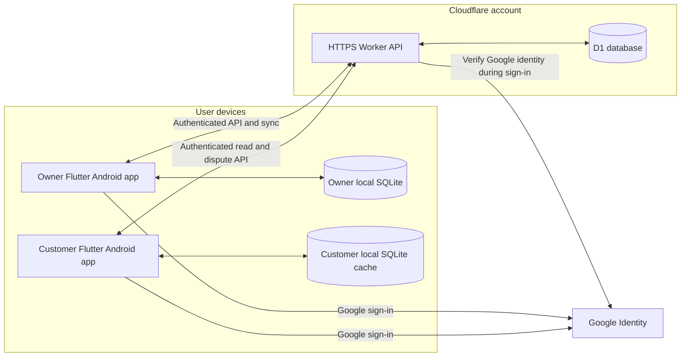

# Udhaar Khata — High-Level Design

<!-- DOC_NAV_START -->
> **Document map:** [Document map](DOCUMENT-MAP.md). **Read with:** [SES](SES.md) · [LLD](LLD.md) · [Security requirements](SECURITY-REQUIREMENTS.md) · [Database design](DATABASE-DESIGN-ERD.md).
<!-- DOC_NAV_END -->

**Version:** 1.0 draft  
**Date:** 29 September 2026  
**Release:** Android v1  
**Status:** D02 scaffold and D03 local persistence implemented; identity, user-facing domain features and deployment remain planned  
**Requirements:** [Scope](SCOPE.md) · [PRD](PRD.md) · [SRS](SRS.md)  
**Companion engineering document:** [SES](SES.md)

## 1. Architecture goal

Support a fast QR-based customer-credit ledger while preserving exact balances, cross-shop privacy and useful offline operation. The shop owner can save entries for previously linked customers without internet. Once online, the mobile app sends pending operations to a Cloudflare Worker, which validates permissions and commits them to D1. The customer sees only server-acknowledged entries after their app refreshes.

The design optimizes for a small first release: one owner account per shop, one shop per owner, customer accounts in multiple shops, INR, and no staff or bank-payment integration. The app is free to users, but D1 and Workers have finite free allowances. Capacity is measured and controlled rather than assumed unlimited.

## 2. System context and trust boundaries



**Boundary A — device to Worker:** The app is untrusted input. It may hold locally saved entries and a scoped cache, but it cannot assign itself a shop, customer or role. Every cloud operation passes through the Worker over HTTPS. No D1 binding or administrative credential is shipped to devices.

**Boundary B — Worker to D1:** The Worker is the sole application writer/reader of D1. It validates inputs, authenticates sessions, checks ownership and executes scoped, prepared database statements. Administrative access and backup procedures are separate from public routes.

**Boundary C — Google identity:** Google proves the signed-in account. The Worker verifies the ID token and maps Google's stable subject to an internal user ID. Email and display name remain changeable profile fields, not ownership keys. Google documents server-side validation of signature, issuer, audience and expiry. [Google OpenID Connect](https://developers.google.com/identity/openid-connect/openid-connect)

**Boundary D — QR presentation:** The customer's QR contains only a versioned, random public lookup identifier. It is neither an authentication token nor permission to post debt. A copied image can be presented by another person; the owner must verify the displayed customer identity and amount before Submit. Server permissions are checked even when the owner scanned a previously cached QR.

## 3. Logical components and ownership

| Component | Main responsibility | Owns / does not own |
|---|---|---|
| Flutter presentation | Role-specific screens, QR display/scan, transaction confirmation, status and accessible English/Hindi content | Does not decide cloud authorization or trust a QR as consent. |
| Mobile identity/session | Google sign-in, secure app-session storage, account switching | Does not store Google password or expose another account's cache. |
| Local ledger repository | SQLite cache, owner entry creation, pending outbox, last-sync cursors, customer cached read view | Owns provisional owner data; cannot claim pending data is cloud-backed up. |
| Sync coordinator | Retry, pull changes, reconcile immutable IDs and surface failed operations | Keeps same operation ID on retry; never overwrites posted history by timestamp. |
| Worker API edge | HTTPS routing, request validation, authentication, rate limits, stable errors | All app-to-D1 traffic passes through it. |
| Authorization policy | Owner shop check, customer-own-ledger check, link check, operator separation | Ignores client-supplied claims of ownership. |
| Ledger service | Link customer, post credit/payment/correction, calculate/reconcile balances, disputes | Preserves immutable entries and idempotent writes. |
| Read/export service | Paginated shop/customer views, statements and scoped export | Returns only authorized data, with freshness/version metadata. |
| D1 | Acknowledged accounts, shops, links, entries, disputes, sessions/operation outcomes and requests | Authoritative for cloud-acknowledged data. |
| Operations | Environment config, migration, monitoring, backup/restore and support | Does not rely on PDF/CSV as complete database backup. |

This is a logical decomposition. The Worker may be deployed as one service and the mobile components as modules in one Flutter application for v1. Exact packages, endpoint payloads and SQL schema belong in the later LLD, database and API documents.

## 4. Data ownership and consistency model

| Data | Source of truth | Local behavior |
|---|---|---|
| Google identity claim | Google, verified by Worker | App holds only a session scoped to the signed-in account. |
| Shop/customer link and active QR status | D1 after online verification | Owner caches verified links for offline repeat scanning; unknown link cannot be created offline. |
| Posted credit/payment/correction | D1 after acknowledgment | Owner writes a provisional entry plus outbox record locally first. |
| Owner pending entry | Owner's local SQLite only | Displayed as Waiting to sync; may be unrecoverable if device is lost. |
| Customer ledger view | D1 latest acknowledged version | Customer caches last synced view, labeled with timestamp when offline. |
| Balance | Derived from immutable entry effects or a reconciled projection | Owner may show a local balance including Pending entries, clearly distinguished from synced balance. |
| Dispute | D1 after online submit | Customer may read cached status; new dispute submission needs internet. |

Money is represented as integer paise. A credit increases owed balance, a payment decreases it, and a correction contributes a signed adjustment while preserving the original. The app never trusts a balance sent by the client as authoritative. Due dates may be stored per credit entry; aggregate overdue amounts wait until a payment-allocation rule is approved and tested.

### Consistency promise

The architecture promises an **exactly-once ledger effect per operation ID**, not exactly-once network delivery. The app may send the same operation several times; the Worker must return the first committed result for repeats. A locally pending operation is visible only in the owner's provisional view. Once D1 acknowledges it, customer and owner views converge after both clients sync the same version.

## 5. Key end-to-end flows

### 5.1 First-time customer link and credit

```mermaid
sequenceDiagram
  participant C as Customer app
  participant O as Owner app
  participant W as Worker
  participant D as D1
  C->>C: Show cached or newly issued QR
  O->>O: Scan QR
  O->>W: Resolve public QR ID
  W->>D: Look up active QR and existing shop link
  D-->>W: Customer identity and link state
  W-->>O: Minimal display identity
  O->>O: Owner confirms person and Add customer
  O->>W: Create shop-customer link
  W->>D: Insert unique link
  D-->>W: Link or existing link
  W-->>O: Linked customer
  O->>O: Review identity and amount; Submit
  O->>O: Save local pending entry
  O->>W: Post entry with operation ID
  W->>D: Validate owner/link and commit once
  D-->>W: Committed entry
  W-->>O: Acknowledgment
  O->>O: Mark Synced
  C->>W: Refresh own ledger
  W-->>C: Own acknowledged entry
```

The unknown QR lookup and link are online-only. Repeating link creation returns the existing relation. The owner can cancel before credit Submit without creating a transaction. A copied QR is not treated as proof that the account holder approved the amount.

### 5.2 Offline repeat credit or payment

1. Owner scans a QR whose customer-to-shop link is already in a verified local cache, or opens that customer's ledger from the local list.
2. App validates a positive INR amount and saves an immutable local entry and pending outbox operation together.
3. Local balance updates and the entry shows **Waiting to sync**. The customer does not yet see the entry.
4. When online, the sync coordinator sends the original operation ID. Worker rechecks owner and link permissions and commits once. It returns the committed result even after a retry caused by a lost response.
5. App marks Synced and pulls any server changes. If permission/validation prevents commit, it retains the local operation as Needs attention. An offline payment that now exceeds the server balance is not silently converted into an advance.

Cloudflare documents that D1 can be accessed from Workers through bindings and prepared statements, and that batched statements execute transactionally. The LLD will choose the exact atomic write pattern for entry plus idempotency outcome, then test it under retries and failures. [D1 Worker binding](https://developers.cloudflare.com/d1/worker-api/), [D1 batch behavior](https://developers.cloudflare.com/d1/worker-api/d1-database/)

### 5.3 Customer read and dispute

The customer signs in, requests their linked shops and one shop's history, and receives data filtered by the authenticated internal user ID. They cannot query another customer's ledger by changing an ID in a URL. Offline, they can read the last synced cache with a clear timestamp. Reporting an entry dispute requires internet and creates a separate dispute record; it does not alter the ledger balance. The owner may resolve it with a note and, if needed, post a separate correction.

### 5.4 New-device recovery

After Google sign-in on a replacement phone, the Worker returns only that user's authorized, server-acknowledged records. The UI shows a last-sync time and explains that pending entries on a lost old phone were not in D1. Operational backups serve database disaster recovery; they do not restore entries that were never synced.

## 6. Security and privacy architecture

- Verify Google ID tokens on the server using trusted keys and required claims; issue short-lived app sessions with a revocable refresh mechanism. The exact token format, lifetime and revocation storage are LLD decisions.
- Enforce authorization inside Worker services and scoped D1 queries: owner shop, linked customer, or restricted operator. Every endpoint has a documented access rule.
- Validate request type/size and use parameterized D1 statements. Rate-limit QR lookup, sign-in, disputes and exports. A random QR ID reduces guessing but does not replace rate limiting.
- Keep sessions in Android secure storage and financial cache separated by signed-in account. Clear or protect local data on account switch without discarding unresolved pending operations silently.
- Avoid collecting contacts, location, phone number or bank details in v1. Do not put transaction amounts, notes, emails, tokens or customer names in QR payloads or analytics events.
- Retain original transaction and correction history. Apply a reviewed privacy/retention policy to exports, access removal and deletion; one customer's removal from their app must not silently erase the shop's historical ledger.
- Separate production and nonproduction data, secrets and D1 bindings. Administrative access and data export are restricted and audited.

The later **Security Requirements** document will turn these boundaries into controls and verification cases. Privacy/legal wording and retention duration remain launch decisions in the [SRS](SRS.md#11-open-decisions-and-change-control).

## 7. Availability, failure and recovery

| Condition | Mobile response | Cloud/system response |
|---|---|---|
| Owner loses internet, linked customer | Save entry locally and mark Pending | No cloud claim until acknowledged. |
| Owner loses internet, unknown QR | Show internet-needed state; create no link | No unverified customer record. |
| Worker/D1 temporary error or quota | Keep existing linked entries Pending; show last sync and retry path | Return stable retryable error; monitor and apply capacity response. |
| Server rejects old link or invalid operation | Keep local record as Needs attention, without presenting it as posted | Do not alter authoritative ledger; return scoped reason code. |
| App crashes after local save | Restore outbox and entry from SQLite on restart | Retry original operation ID. |
| Server commits but response is lost | Retry with same operation ID | Return original committed result, with one balance effect. |
| Phone lost before sync | New device restores acknowledged records only | D1 has no copy of unsynced records. |
| D1 corruption/accidental deletion | Pause affected writes, communicate impact | Restore from tested encrypted operational backup to a separate environment, reconcile before resuming. |

No deployment topology can guarantee recovery of data that never left a lost device. The app must make that limit visible rather than hide it in policy text.

## 8. Scale, quota and performance approach

Cloudflare's current Workers Free D1 allowance lists **5 GB total storage, 5 million rows read per day and 100,000 rows written per day**. Workers have separate usage limits. D1 read and write billing counts rows examined/written, and indexes affect row operations and storage. On the free plan, reaching a daily D1 limit causes D1 queries to fail until reset; reaching storage limit blocks new writes. These are current provider facts, not a product promise. [D1 pricing and limit behavior](https://developers.cloudflare.com/d1/platform/pricing/), [Workers pricing](https://developers.cloudflare.com/workers/platform/pricing/)

Design responses:

- Index common scoped lookups (owner shop, QR ID, shop/customer history, idempotency ID), paginate ledger history, and avoid full table scans on home refresh.
- Batch bounded sync operations and use incremental cursors; do not fetch all history on every app open.
- Observe Worker request count/error rate and D1 rows read/written/storage; set warning thresholds before the free limits. Logs exclude financial content and tokens.
- If quota pressure rises, reduce nonessential reads, pause new onboarding and make local Pending status explicit. Decide funding/capacity before wide public growth.
- Benchmark real pilot patterns rather than estimate viability solely from stored row size; indexes and usage volume matter.

Core owner screens should render from local data without waiting for network. The product's pilot target is a median under 15 seconds from successful linked scan to local save on supported test phones; actual hardware and measurement method must be specified in the pilot.

## 9. Deployment environments and operations

| Environment | Purpose | Data policy |
|---|---|---|
| Local development | Engineer feedback and schema/API tests | Synthetic records only. |
| Staging | Integrated Google sign-in, Worker/D1, Android test builds and recovery rehearsal | Synthetic or consented test data; separate identities/secrets/bindings from production. |
| Production | Pilot and public app after gates | Real financial data, restricted access, monitoring and operational backups. |

Deploy schema changes through versioned migrations, then compatible Worker changes, then app releases that can handle server versions during rollout. Keep an incident/rollback plan for API and schema changes; restoring or reversing a migration involving financial records requires a tested procedure. Production deployment and public release require separate approval under the workspace's external-action boundary.

## 10. Architecture decisions and deferred detail

| Decision | Rationale | To specify next |
|---|---|---|
| Flutter Android + SQLite | One Android codebase with local durable storage for offline use | Local schema, package choice, account cache boundaries in LLD. |
| Worker as sole D1 gateway | Central validation, permissions and controlled cloud access | API contracts, auth/session lifecycle and rate limits. |
| Immutable ledger plus correction entries | Reconstructable balances and disagreement history | Exact signed-entry schema, correction constraints and balance queries. |
| Operation-ID idempotency | Safe retries across network loss | Unique constraints, transaction/batch sequence, response replay retention. |
| QR lookup ID, not secret | Simple customer-presented identity flow without financial data in code | QR format/rotation, cache treatment and abuse controls. |
| Owner local-first writes | Counter continues without internet | Outbox state machine, sync order and conflict response. |
| Customer read cache | History available offline with freshness label | Cache invalidation and access-removal behavior. |

The next **LLD**, **Database Design / ERD** and **API Specification** should make these interfaces and constraints concrete without changing the approved [PRD](PRD.md) and [SRS](SRS.md). Open product decisions—payment allocation for overdue totals, exact input bounds, retention period, backup destination and supported Android versions—remain visible in those documents rather than being silently invented here.

## 11. References

- [Cloudflare D1 Worker binding API](https://developers.cloudflare.com/d1/worker-api/)
- [Cloudflare D1 database methods and batch semantics](https://developers.cloudflare.com/d1/worker-api/d1-database/)
- [Cloudflare D1 pricing and free-tier behavior](https://developers.cloudflare.com/d1/platform/pricing/)
- [Cloudflare Workers pricing](https://developers.cloudflare.com/workers/platform/pricing/)
- [Google OpenID Connect token validation](https://developers.google.com/identity/openid-connect/openid-connect)

Provider terms and API behavior should be checked again before implementation and launch.

### D04 implementation checkpoint

Local auth verifies Google identity using trusted JWKS, maps immutable subject and role, issues hashed 15-minute opaque access credentials and rotating refresh credentials capped at 30 days from initial issue, and revokes the session on spent-token replay/logout. Android secure storage and role selection/sign-out are wired; Pending records stay account-isolated and locked on sign-out. See the API session policy, security requirements and implementation progress for checks and limits. Live Google configuration, device evidence and deployment remain pending; this is not a public-release claim.


### D07 implementation checkpoint

Owner scanning accepts only the bounded exact `udhaar://customer/v1/{publicId}` format, requests camera permission only on scan, and provides permission retry/settings and invalid/version/revoked/internet-needed states. An online lookup authorizes the shop before displaying minimal customer identity and makes no link or financial change. Explicit Add customer creates one active relationship using an atomic, scoped D1 batch and operation receipt; same-ID/body retries replay, changed bodies conflict, and concurrent different IDs for the same shop/customer return the existing link. Live QR/ownership/customer predicates are checked at commit. Removed access is not restored by scanning. Original confirmed command bodies are saved in account/shop-specific secure storage before POST and retained after response loss/restart; new scans cannot replace an unresolved confirmation. The bounded customer list states overflow and returning customers open an authorized ledger screen. Credit/payment/history and complete pagination remain D08-D10; owner offline cache/sync remain later gates. Physical camera/device and remote D07 deployment evidence are recorded separately in implementation progress.

### D08 online credit implementation contract (2026-10-01)

Approved pilot limits v1: positive credit ₹0.01–₹1,00,000.00 (1–10,000,000 integer paise), optional trimmed note up to 500 UTF-16 code units, valid optional YYYY-MM-DD due date, financial JSON body at most 4,096 bytes, and existing first-100 list ceiling. General JSON/auth bodies retain the 65,536-byte ceiling. The Worker validates strict credit fields and canonical UUID v4 operation identity; unknown/forged effect fields and payment/correction variants are rejected in D08. A first online command accepts device occurrence time from 24 hours before server time to 5 minutes ahead. Receipt replay precedes this mutable clock check. Payments, corrections, full history/pagination and offline local ledger remain their later phases.

The owner opens a linked customer, enters amount/note/date, reviews customer identity and the explicit Customer owes you direction, then confirms. Review has no financial effect. The app durably saves an account/shop/link-specific command before POST and never generates a replacement ID after uncertainty. Reopening the form recovers that body with Check same credit; a response must match shop, link, type, amount/effect, note/date, occurrence time and sequence before acknowledgement. Unverified responses, storage failures, auth/network failure and rejected requests retain the saved record for recovery; it is not silently discarded. This online recovery record is not the D11 offline ledger/outbox, and does not provisionally change the visible balance.

The Worker uses the existing immutable ledger triggers and atomic entry-plus-receipt batch; live authorization is rechecked at commit and replay requires current access. Receipt retries return the original committed balance/version even after later entries, explicitly labeled as the balance when this credit was recorded. Owner link/list reads refresh the current balance. Customer My shops receives its own active link balances/versions from the same profile query and can refresh them. New minimal balance reads authorize the entire current snapshot in one SQL query; no history page or aggregate overdue total is inferred. No new migration is needed.

### D10 online history checkpoint (2 October 2026)

D10 online read models share the existing authenticated Worker/D1 boundary. History is an immutable-sequence snapshot; lists are bounded live reads with new-link exclusion during traversal. An environment-local D1 cursor key provides AES-GCM authentication/confidentiality without a new external credential binding. Mobile read snapshots are in memory and account-bound; general offline cache/sync remains D11–D13. Deploy migration 0003 before the new Worker; additive schema permits prior-code rollback.


### D11 local ledger/outbox checkpoint (2 October 2026)

D11 adds an owner device ledger on the existing account-private SQLite database. Opening a customer online first caches a complete authorized history snapshot only after all pages reconcile by entry sum, count and server high-water. Later opens use that dated local snapshot; explicit Refresh from server fetches a new one. Unknown links need internet. Automatic bootstrap is capped at 10,000 acknowledged entries; larger ledgers retain the paginated confirmed-server-history view.

Owner credit/payment confirmation creates a UUID once and atomically saves the immutable provisional entry, canonical outbox payload, account/shop-bound local integrity hash and balance effect before reporting success. No new-command HTTP is issued in D11, even online. Synced balance is reconstructed from acknowledged entries; provisional balance adds Pending effects and excludes Needs attention. Payments cannot make the known local balance negative. Pending is only on this device and is not cloud-backed up; customer views remain acknowledged-only.

Unresolved D08/D09 secure-storage commands retain their original Check same credit/payment recovery path and block new local replacements until resolved. General serial push/pull, server reconciliation, permanent-rejection handling and offline cold-start session restoration remain D12; offline QR lookup and replacement-phone recovery drills remain D13. D11 makes no server/API, Google configuration or signing-key change.

## D12 executable architecture checkpoint (2 October 2026)

DeviceSyncCoordinator owns one generation-bound serial run per owner/shop, with at most 20 commands and 20 pull pages. SyncService shares the authenticated account database and owns lifecycle, local-save and manual triggers. Retry schedules survive restart in account-private SQLite; network/429/quota/5xx stop the run, while link-specific failures block only that link. D1 remains authoritative; original command IDs and bodies remain immutable.

The owner incremental feed returns authorized link metadata, ascending acknowledged entries, a fixed high-water and an authenticated one-hour continuation cursor. Acknowledgements and pages reconcile by server/operation identity transactionally; the durable pull cursor advances only with applied pages, never with a push receipt. Complete snapshot time remains separate from partial refresh time. Public health capabilities prevent an older or rolled-back Worker route from being mistaken for removed access.

A secure-storage grant permits existing account-cache access for 30 days after online verification, without cloud authorization or offline renewal. Database leases validate grant time and session generation before and after each transaction. SQLite remains app-private rather than SQLCipher-encrypted; physical extraction and Android platform gates remain pending.
