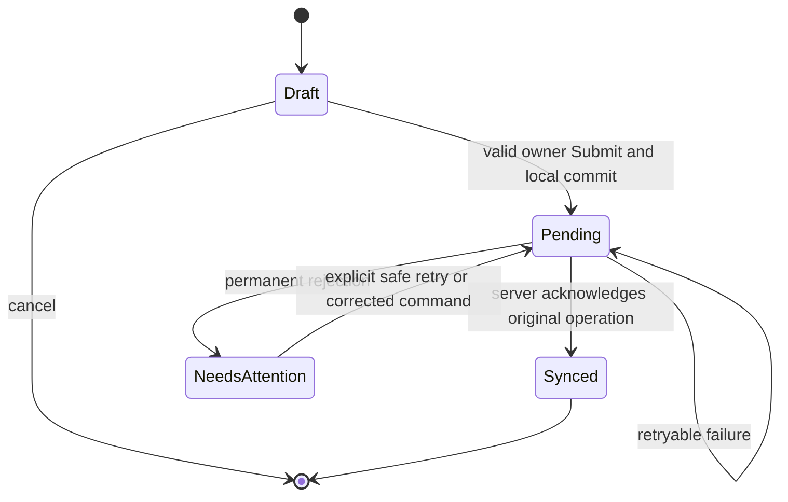

# Udhaar Khata — Low-Level Design

<!-- DOC_NAV_START -->
> **Document map:** [Document map](DOCUMENT-MAP.md). **Read with:** [HLD](HLD.md) · [Database design](DATABASE-DESIGN-ERD.md) · [API specification](API-SPECIFICATION.md) · [Coding standards](CODING-STANDARDS-DEVELOPMENT-GUIDELINES.md).
<!-- DOC_NAV_END -->

**Version:** 1.0 draft  
**Date:** 29 September 2026  
**Release:** Android v1  
**Status:** D02 skeleton and D03 local database adapters implemented; identity and domain feature routes remain planned  
**Baseline:** [HLD](HLD.md) · [SES](SES.md) · [SRS](SRS.md) · [PRD](PRD.md)

## 1. Design contract

The Flutter app saves owner entries locally first for a previously linked customer. A Cloudflare Worker validates and posts them to D1 when online. D1 is authoritative for acknowledged entries, while a locally pending entry is provisional and may be lost if the phone is lost before sync. The customer reads only acknowledged entries and can report a dispute online.

The key invariants are:

1. One shop/customer relationship per pair; one active shop per owner in v1.
2. Exactly one ledger effect for a given `(shop_id, client_operation_id)`, even if the HTTP request is retried or its response is lost.
3. All amounts are positive integer paise at entry; balance effects are signed integer paise. No floating-point money arithmetic.
4. A posted ledger entry is immutable. A correction is a new, linked entry with a reason.
5. Payments cannot exceed the authoritative amount owed at commit time; an offline payment that fails this check stays local as **Needs attention**.
6. Owner and customer permissions are derived from verified server identity, never from QR contents or client-supplied role fields.
7. Unknown QR lookup/linking requires internet. A cached linked QR can identify that customer offline, subject to authorization again at sync.
8. Customer views never show an owner-only Pending entry as already posted.

## 2. Package and module layout

This layout is a proposed separation of responsibilities, not a commitment to a particular state-management or routing library.

```text
udhaarkhata/
  lib/app/                 # bootstrap, routes, role shell, localization
  lib/core/auth/           # Google sign-in and app-session adapter
  lib/core/db/             # account-scoped SQLite setup and migrations
  lib/core/network/        # typed HTTP client, retry classification
  lib/core/sync/           # outbox coordinator and pull cursors
  lib/features/qr/         # customer QR display, owner scan and resolve
  lib/features/shop/       # owner home, customer links and list
  lib/features/ledger/     # amounts, balance, entries, corrections
  lib/features/disputes/   # customer report and owner response
  lib/features/sharing/    # reminder, PDF and CSV
  lib/features/settings/   # language, export/deletion and help
  test/                    # domain, repository and widget tests

services/api/
  src/http/                # route registration, errors, validation
  src/auth/                # Google token exchange, sessions
  src/policy/              # owner/customer access checks
  src/qr/                  # public ID issue, resolve and rotate
  src/ledger/              # link, post, correct, balance and history
  src/disputes/            # report and resolve
  src/export/              # scoped statements and data requests
  src/db/                  # D1 prepared statements and migrations
  src/telemetry/           # request metrics and redacted logs
  test/                    # contract, authorization and fault tests
```

The mobile UI calls feature controllers/use cases. Those call repositories; repositories own SQLite or HTTP details. Widgets do not directly write database rows or calculate balances. The Worker route layer does not contain business rules; it validates and calls policy/domain services.

## 3. Domain types and value rules

| Type | Proposed representation | Rule |
|---|---|---|
| `UserId`, `ShopId`, `EntryId`, `LinkId` | Opaque strings | Generated by trusted service or controlled client ID scheme; never inferred from email. |
| `ClientOperationId` | UUID v4 generated once before local save | Stable for every retry of the same owner action. New action gets new ID. |
| `PublicQrId` | At least 128 bits of secure randomness, encoded for QR | Lookup identifier only; rotate/revoke online. |
| `MoneyPaise` | Signed safe integer in Dart and TypeScript; persisted as SQLite/D1 integer | Input magnitude > 0 and within configured per-entry bound. Server checks safe-integer range. |
| `EntryKind` | `credit`, `payment`, `correction` | Credit effect positive; payment negative; correction signed. |
| `SyncStatus` | `pending`, `synced`, `needs_attention` | Draft form is separate and has no ledger effect. |
| `OccurredAt` | User-visible event time plus server received time | Show timezone-aware local date; server ordering never relies on device time alone. |
| `RequestHash` | Digest of canonical command body and authenticated scope | Same operation ID with different body is rejected. |

Suggested entry object:

```text
LedgerEntry {
  id, shopId, customerUserId, kind,
  amountPaise, signedEffectPaise,
  note?, paymentMethod?, dueDate?,
  correctsEntryId?, correctionReason?,
  createdByUserId, occurredAt, serverCreatedAt?,
  clientOperationId, serverSequence?, syncStatus
}
```

`amountPaise` is the positive amount entered or target amount displayed to the user; `signedEffectPaise` is what changes balance. For a ₹500 credit corrected to ₹450, the correction has an effect of **−₹50** while the original +₹500 remains in history. The precise correction schema and concurrency guard are specified in the [Database Design / ERD] document that follows this one.

For first release, payment input cannot exceed the currently recorded owed amount. Advances and negative balances are outside scope. The configured maximum amount, note length and dispute reason length are set before pilot per [SRS open decisions](SRS.md#11-open-decisions-and-change-control); they must be enforced on both device and Worker.

## 4. Mobile application components

### 4.1 Account and session boundary

The identity adapter obtains a Google ID token and sends it over HTTPS to the Worker. The Worker verifies it and returns an application access session and rotating refresh credential. Proposed initial policy: access credential lifetime around 10–15 minutes; refresh credential bound to a device/session and stored hashed on the server. The exact format, duration and revocation behavior require a security review before implementation. Google `sub` maps to internal user ID; email and display name are informational.

The mobile app stores credentials in Android secure storage, not SQLite. Each local database namespace is bound to the internal user ID. On sign-out or account switch, show Pending count and block silent deletion of unresolved operations. Clear or lock the old account's local data only after the user chooses a safe recovery/export path. A newly signed-in account cannot read the previous account's cache.

### 4.2 Local SQLite repositories

| Repository | Local responsibility |
|---|---|
| `AccountRepository` | Internal user, role, shop memberships and last verified account state. |
| `QrRepository` | Own public QR cache for customer; verified linked public IDs for owner; active/revoked state last known online. |
| `LedgerRepository` | Local entries, balance projection, pending/rejected state, paginated history. |
| `OutboxRepository` | Durable operation body, operation ID, request hash, attempt count, retry time and error class. |
| `CursorRepository` | Last successful resource cursors and sync timestamp, scoped by account/shop/customer. |
| `DisputeRepository` | Last synced dispute status and entry association. |

An owner command uses one local SQLite transaction to insert an entry, insert its outbox item and update any local projection. Failure of any part rolls back all three. A customer cache update and its cursor advance likewise occur together, so a crash cannot skip unseen server records. The local database schema and migration plan will be made concrete in the database document.

### 4.3 Sync coordinator

The coordinator runs at app start, connectivity regain and explicit retry, subject to battery/network constraints. It processes bounded outbox batches in creation order for one shop and pulls server changes after acknowledged writes. Only one active sync worker per local account/shop may claim a given outbox operation. A process restart can resend the same operation ID safely.

```text
for each pending operation in stable local order:
  if session cannot refresh: stop; keep operation pending
  send original operation ID and original payload
  if acknowledged or duplicate-with-same-hash:
    in one local transaction:
      attach server ID/sequence and mark entry synced
      mark/remove outbox receipt
  else if retryable network/5xx/429/quota error:
    record attempt and bounded backoff; keep pending
    stop or continue only if later operations are independent
  else if permission/validation/conflict:
    mark needs_attention; retain full local record
    stop dependent operations and show resolution path
pull scoped server changes using stored cursor
upsert by server ID/operation ID; advance cursor atomically
```

No “last write wins” merge is used for posted transactions. Different owner operations can append independently when permitted; corrections and payments must be revalidated against current server state. Sync state is observable per entry and in the owner home summary. Temporary quota failure may leave local entries Pending for a long time; the UI must state they are only on the device.

### 4.4 Flutter feature controllers

| Controller/use case | Inputs and result |
|---|---|
| `OpenCustomerByQr` | Decode/version-check QR; use verified local link or request online resolution; return linked, new, invalid, revoked or needs-internet state. |
| `LinkCustomer` | Authenticated owner + resolved public ID + optional nickname; return unique link or existing link. |
| `SaveCredit` | Linked customer + positive amount + optional note/due date; return local Pending entry and new local balance. |
| `SavePayment` | Linked customer + amount ≤ locally recorded balance + manual method; return Pending entry or field error. |
| `SaveCorrection` | Original entry + target amount/reason; return Pending correction, subject to server revalidation. |
| `LoadOwnerLedger` | Shop/customer scope; return cached entries, provisional balance, sync timestamp and status. |
| `LoadCustomerLedger` | Authenticated customer + selected shop; return last acknowledged cache and last sync time. |
| `ReportDispute` | Own acknowledged entry + reason while online; return Open/duplicate-existing status. |

The controller returns typed outcomes; the UI maps them to English/Hindi messages and accessible states. Do not use broad catch-all success messages for unknown server outcomes.

## 5. Worker request pipeline

For every protected request:

```text
request ID and safe telemetry context
  → method/path and body-size check
  → authenticate application session
  → parse and validate request schema
  → rate limit where applicable
  → authorize role and shop/customer relationship
  → execute domain command or scoped query
  → map domain outcome to stable JSON and HTTP status
  → emit redacted timing/error/row-usage metrics
```

Authorization must run even when the mobile client sends a previously cached shop/customer ID. Customer reads derive customer identity from the authenticated session; an arbitrary customer ID in the URL cannot grant access. Owner writes check current shop ownership and active link at commit time. QR resolution returns the smallest display identity needed for confirmation and is rate-limited to resist enumeration.

### 5.1 Authentication and QR services

`ExchangeGoogleIdToken` verifies signature, issuer, audience, expiry and subject before mapping/creating an account. Use trusted Google libraries/keys; the debugging `tokeninfo` endpoint is not the production verification mechanism. `RefreshAppSession` rotates a refresh credential and invalidates the old one. `Logout` revokes the session. Protected financial routes recheck account and relationship status even if an access credential has not expired.

`IssuePublicQrId` uses a secure random source. `ResolvePublicQrId` validates version and active status, then returns minimal display identity. `RotatePublicQrId` revokes the old identifier and issues a new one in one server operation; existing shop links remain attached to internal customer identity. A cached old QR may still identify an already-linked customer offline; server link authorization, not QR status alone, determines whether a queued entry may post. The app refreshes QR/cache state when online.

### 5.2 Link-customer command

Input is owner session, owner's shop ID, resolved active customer public ID, optional nickname and idempotency key. In one committed operation, confirm shop ownership and active QR, then create a unique `(shop_id, customer_user_id)` link or return the existing one. The result never returns another shop's data. An invalid/revoked ID, unknown customer or offline request cannot create a placeholder link.

### 5.3 Post-entry command and idempotency

Each transaction command includes `client_operation_id`, kind, customer/shop scope and business fields. Build a canonical request hash from authenticated owner + shop + operation kind + validated fields. The Worker first looks for a committed operation receipt with that `(shop_id, client_operation_id)`:

- Same hash → return the original committed entry and balance/version.
- Different hash → return an idempotency-key-reused error; never reinterpret the old key.
- No receipt → authorize and validate against current data, then atomically write the ledger entry and its receipt. A database uniqueness constraint handles a race between simultaneous requests; on conflict, read and compare the existing receipt before responding.

For payments, enforce the nonnegative-balance invariant against the authoritative current balance **inside the same atomic database operation** that posts the payment. For corrections, determine the current effective amount for the referenced entry and guard its revision before applying the signed delta. The exact conditional SQL and constraints belong in the next database document; a pre-read in application code alone is insufficient because concurrent requests could pass it.

Cloudflare documents D1 prepared statements and transactional `batch()` behavior. The database implementation should use parameterized statements and prove rollback, uniqueness and conditional guards with integration tests. [D1 Worker API](https://developers.cloudflare.com/d1/worker-api/), [D1 batch semantics](https://developers.cloudflare.com/d1/worker-api/d1-database/)

### 5.4 Query and export paths

Owner list/history queries always filter by authenticated owner's shop and paginate by stable server ordering. Customer query starts from authenticated internal user ID and selected linked shop; no client-provided customer ID is trusted. Return an opaque cursor and last server version/sequence. Exports use the same scoped entry set and balance rules as the UI. A date-range export includes opening balance, signed entries and closing balance. PDF/CSV generated from Pending local entries must be labeled or excluded according to the phase-3 product decision, never silently mixed with server-acknowledged records.

## 6. Balance, payment and correction algorithms

```text
entryEffect(credit, amount)     = +amount
entryEffect(payment, amount)    = -amount
entryEffect(correction, delta)  = delta
balance(shop, customer)         = sum(entryEffect for committed entries)
localProvisionalBalance         = committed/cached balance + eligible local pending effects
```

The canonical balance is the sum of committed entry effects or a projection kept transactionally consistent and periodically reconciled with that sum. A payment must satisfy `0 < payment ≤ authoritative balance` at commit. Client-side validation against cached balance improves UX but does not replace server validation. If the authoritative balance changed during an offline interval, the server rejects a now-invalid payment and the client retains it for review.

Correction command is phrased as **set this original transaction's effective contribution to a target amount**, with a reason. The service calculates `delta = targetContribution − currentEffectiveContribution` and writes a correction effect atomically with an expected revision check. This supports repeated corrections without double-adjusting the ledger. A negative target/invalid amount is rejected; cancellation is target zero. A correction cannot refer to an entry in another shop/customer ledger. The original and every correction remain visible. The schema must make each correction's prior effective contribution and revision reconstructable.

No aggregate overdue amount is displayed until an approved payment-allocation algorithm exists. The proposed rule is oldest unpaid credit first, then entry ID for ties, but it is an open product decision. Due dates can still be shown on individual credit entries without claiming a calculated overdue total.

## 7. Local and remote state transitions



When an operation is permanently rejected, the local entry stays visible with its original details. The UI must not include its effect in a figure labeled as server-synced. Resolution may create a new operation ID if the user intentionally changes the command; never silently mutate the old posted payload under the same ID. An accepted correction is a separate synced entry, not an edit of the original.

## 8. Error classification and recovery

| Class | Example | Worker outcome | Mobile handling |
|---|---|---|---|
| Auth required | Expired/revoked app session | `AUTH_REQUIRED` | Refresh online; preserve outbox and cached data. |
| Forbidden | Lost shop ownership/link | `FORBIDDEN` | Needs attention; do not retry blindly. |
| Input invalid | Zero amount, wrong QR version | `VALIDATION_ERROR` / `QR_INVALID` | Field/scan explanation; preserve draft. |
| Business conflict | Payment exceeds current owed, correction revision changed | `BALANCE_CONFLICT` / `REVISION_CONFLICT` | Needs attention; show server balance/current entry for review where authorized. |
| Duplicate same command | Lost response, same ID/hash | Original successful result | Mark local operation Synced once. |
| Duplicate key with changed command | Same ID, different hash | `IDEMPOTENCY_CONFLICT` | Do not post; require new intentional action/ID. |
| Temporary unavailable | Network timeout, Worker/D1 5xx | Retryable error | Keep Pending; exponential backoff with jitter. |
| Capacity limit | D1 or Worker free quota | `CAPACITY_UNAVAILABLE` if Worker can respond | Keep Pending; suspend new linking and surface status. |

Error responses include stable machine code and request ID but no other customer's identity or transaction details. Unknown authorization/identity results fail closed. A retryable transport error never causes the client to generate a new operation ID for the same action.

## 9. Data protection and observability

- Token and refresh secrets stay in Android secure storage and server-controlled secrets/session stores, not in QR, SQLite ledger rows or analytics.
- Financial notes, amount values, Google ID tokens, QR IDs and full customer names are excluded from routine logs and telemetry. Support uses request IDs and scoped metadata.
- Local caches are partitioned by account; customer access removal purges/locks that customer's cached view after online confirmation while preserving the owner's historical ledger under the reviewed retention policy.
- Worker metrics include route, latency, status/error class, D1 rows read/written, storage trend and sync outcomes. Mobile metrics include outbox age/count and state transitions without monetary content.
- Staging and production use separate Google OAuth configuration, Worker bindings, D1 databases, secrets and telemetry. Never copy live shop ledgers into test environments without a reviewed process.

## 10. Verification seams and required tests

| Component | Required test seam / scenario |
|---|---|
| Money domain | Paise parsing, overflow/bound checks, balance sum, correction delta and payment cap. |
| QR parser | Valid version, malformed code, revoked code, unknown offline code, copied QR does not authorize a post. |
| Local repository | Atomic entry + outbox save, crash/restart survival, account isolation and migration. |
| Sync coordinator | Lost HTTP response after commit, duplicate replay, bounded retry, rejection and cursor transaction. |
| Policy service | Cross-owner/shop/customer reads/writes denied; customer disputes only own entries. |
| D1 command handler | Concurrent same-ID requests, same ID/different payload, payment races, repeated corrections and rollback. |
| Recovery | New phone restores acknowledged entries only; old device Pending entry is not falsely claimed. |
| Quota/outage | Local linked write remains Pending; new QR link unavailable; status visible and no data dropped. |

Tests should assert external behavior and invariants, not simply mirror helper implementations. The [Test Plan] and [QA Checklist] later in the documentation sequence will provide full case IDs and execution gates.

## 11. Decisions carried to the next documents

| Detail | Planned resolution |
|---|---|
| Exact D1 and local SQLite columns, constraints, revision guard and indexes | [Database Design / ERD] next; prove conditional payment and correction writes under concurrency. |
| Endpoint paths, payload schemas, pagination limits, status codes and examples | API Specification after database design. |
| Session-token format and exact lifetimes, rate limits and backup key custody | Security Requirements and deployment design, reviewed before live data. |
| Maximum money amount, note length, dispute length, supported Android versions | Fix at SRS phase gates before pilot. |
| Export inclusion of Pending, retention period and customer re-link semantics | Product/privacy decisions before phase 3 exit or public launch. |

Any implementation choice that changes a first-release user journey or financial invariant requires corresponding updates to the [BRD](BRD.md), [PRD](PRD.md), [SRS](SRS.md) and [HLD](HLD.md).

### D04 implementation checkpoint

Local auth verifies Google identity using trusted JWKS, maps immutable subject and role, issues hashed 15-minute opaque access credentials and rotating refresh credentials capped at 30 days from initial issue, and revokes the session on spent-token replay/logout. Android secure storage and role selection/sign-out are wired; Pending records stay account-isolated and locked on sign-out. See the API session policy, security requirements and implementation progress for checks and limits. Live Google configuration, device evidence and deployment remain pending; this is not a public-release claim.


### D07 implementation checkpoint

Owner scanning accepts only the bounded exact `udhaar://customer/v1/{publicId}` format, requests camera permission only on scan, and provides permission retry/settings and invalid/version/revoked/internet-needed states. An online lookup authorizes the shop before displaying minimal customer identity and makes no link or financial change. Explicit Add customer creates one active relationship using an atomic, scoped D1 batch and operation receipt; same-ID/body retries replay, changed bodies conflict, and concurrent different IDs for the same shop/customer return the existing link. Live QR/ownership/customer predicates are checked at commit. Removed access is not restored by scanning. Original confirmed command bodies are saved in account/shop-specific secure storage before POST and retained after response loss/restart; new scans cannot replace an unresolved confirmation. The bounded customer list states overflow and returning customers open an authorized ledger screen. Credit/payment/history and complete pagination remain D08-D10; owner offline cache/sync remain later gates. Physical camera/device and remote D07 deployment evidence are recorded separately in implementation progress.

### D08 online credit implementation contract (2026-10-01)

Approved pilot limits v1: positive credit ₹0.01–₹1,00,000.00 (1–10,000,000 integer paise), optional trimmed note up to 500 UTF-16 code units, valid optional YYYY-MM-DD due date, financial JSON body at most 4,096 bytes, and existing first-100 list ceiling. General JSON/auth bodies retain the 65,536-byte ceiling. The Worker validates strict credit fields and canonical UUID v4 operation identity; unknown/forged effect fields and payment/correction variants are rejected in D08. A first online command accepts device occurrence time from 24 hours before server time to 5 minutes ahead. Receipt replay precedes this mutable clock check. Payments, corrections, full history/pagination and offline local ledger remain their later phases.

The owner opens a linked customer, enters amount/note/date, reviews customer identity and the explicit Customer owes you direction, then confirms. Review has no financial effect. The app durably saves an account/shop/link-specific command before POST and never generates a replacement ID after uncertainty. Reopening the form recovers that body with Check same credit; a response must match shop, link, type, amount/effect, note/date, occurrence time and sequence before acknowledgement. Unverified responses, storage failures, auth/network failure and rejected requests retain the saved record for recovery; it is not silently discarded. This online recovery record is not the D11 offline ledger/outbox, and does not provisionally change the visible balance.

The Worker uses the existing immutable ledger triggers and atomic entry-plus-receipt batch; live authorization is rechecked at commit and replay requires current access. Receipt retries return the original committed balance/version even after later entries, explicitly labeled as the balance when this credit was recorded. Owner link/list reads refresh the current balance. Customer My shops receives its own active link balances/versions from the same profile query and can refresh them. New minimal balance reads authorize the entire current snapshot in one SQL query; no history page or aggregate overdue total is inferred. No new migration is needed.

### D09 payment implementation checkpoint (2026-10-01)

`ledger/commands.ts` shares authorized credit/payment posting and receipt recovery while preserving the original credit hash. Strict HTTP variants dispatch payment with its method; D1 derives the effect and rejects negative balance atomically through existing triggers. `HttpError` optionally exposes the authorized current balance for payment conflict; the mobile error parser validates the integer snapshot and the screen displays it even if a follow-up read cannot connect. No database migration is introduced.

`CloudLedgerRepository` implements credit and payment interfaces with one serialized queue. Payment recovery stores the frozen attempt and rejection flag separately from existing credit keys. `PaymentPage` renders draft, review, uncertainty, rejection/correction and verified receipt states. Archived rejected originals remain in secure storage before a replacement draft; retrying an uncertain attempt never generates a new ID. The owner route refreshes current customer/list balance on return. Full history and general offline sync remain later phases.

### D10 online history checkpoint (2 October 2026)

`http/cursors.ts` validates canonical page queries and creates/decrypts versioned AES-GCM cursors using a singleton D1 random key. `ledger/reads.ts` handles fixed-sequence history, rowid-bounded link lists and retained-account totals; `ledger/read-routes.ts` derives customer identity from session. Owner history uses `/v1/shops/{shopId}/customers/{linkId}/entries`, replacing the proposed query linkId route in the API contract. `OnlineReadRepository` validates scope, sequence/effect/type/date/page shapes; `OnlineRecordsView` guards async responses by repository identity and generation, rejects mixed/duplicate pages, and checks full-history sum/count before accepting the last page. History details are rendered as cards; single-entry correction/effective-revision routes remain later work.


### D11 local ledger/outbox checkpoint (2 October 2026)

D11 adds an owner device ledger on the existing account-private SQLite database. Opening a customer online first caches a complete authorized history snapshot only after all pages reconcile by entry sum, count and server high-water. Later opens use that dated local snapshot; explicit Refresh from server fetches a new one. Unknown links need internet. Automatic bootstrap is capped at 10,000 acknowledged entries; larger ledgers retain the paginated confirmed-server-history view.

Owner credit/payment confirmation creates a UUID once and atomically saves the immutable provisional entry, canonical outbox payload, account/shop-bound local integrity hash and balance effect before reporting success. No new-command HTTP is issued in D11, even online. Synced balance is reconstructed from acknowledged entries; provisional balance adds Pending effects and excludes Needs attention. Payments cannot make the known local balance negative. Pending is only on this device and is not cloud-backed up; customer views remain acknowledged-only.

Unresolved D08/D09 secure-storage commands retain their original Check same credit/payment recovery path and block new local replacements until resolved. General serial push/pull, server reconciliation, permanent-rejection handling and offline cold-start session restoration remain D12; offline QR lookup and replacement-phone recovery drills remain D13. D11 makes no server/API, Google configuration or signing-key change.

Implementation boundaries: `OwnerLedgerDao` admits/replays complete owner snapshots, `SaveLocal` maps confirmed bodies to immutable SQLite commands, and `OutboxDao` returns queue order by insertion rowid. `DeviceLedgerRepository` connects these to forms and retains the legacy cloud repository for preexisting uncertain requests. Provider/account and request-generation checks prevent completed reads from appearing under a replacement account. Local storage failures roll back entry/outbox/projection together and never produce a saved confirmation.

D11 cache-limit recovery: an oversized uncached customer still offers View confirmed server history directly. An existing legacy credit/payment request can open Check same credit/payment after a minimal authorized customer read; complete offline bootstrap is required only for new local commands.

## D12 concrete implementation (2 October 2026)

Local schema v3 is additive from v1/v2. It adds partial refresh/cache-block metadata and sync_retry_state; immutable financial columns and the canonical outbox payload/hash remain protected. A verified server row may acquire an operation ID once, allowing D11 bootstrap data to reconcile with the new feed without a duplicate effect.

SyncService constructs the coordinator against the existing auth database. Local saves trigger work after commit; resume and Sync now coalesce. Each run pulls before posting, posts original ready commands serially, then pulls affected links. The default page is 50 (maximum 100); one run consumes at most 20 pages and 20 commands. Round-robin continuation covers every cached link, including those beyond the former list ceiling. Manual refresh prioritizes the requested cached link through the same coordinator. Global/link retry metadata persists; backoff is 2 seconds exponential capped at a 5-minute base, jittered half-to-full, with valid Retry-After as an uncapped minimum.

A rejected command is retained as Needs attention and blocks successors; it is not automatically returned to Pending by the state diagram's future resolution action. UI shows the original amount/date/method/note and reason. Access removal hides unauthorized cached history but retains the failed original for the owning account. Above 10,000 acknowledged rows the cache is blocked for new offline commands, with confirmed online history available and existing queue retained. Authoritative changes may temporarily make the provisional balance negative; retain them and block new commands rather than alter server history.

LocalAccessGrant is non-sliding, bound to the verified profile, and valid for exactly 30 days. Only a non-mutating preflight failure may preserve unspent credentials and reopen an existing verified cache. An uncertain rotating-refresh attempt locks cache and clears credentials/grant. Every protected transaction checks the time window and generation before, inside and after execution.
