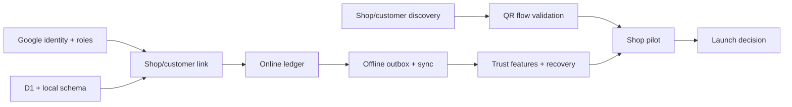

# Udhaar Khata — Project Plan and Roadmap

<!-- DOC_NAV_START -->
> **Document map:** [Document map](DOCUMENT-MAP.md). **Read with:** [Scope](SCOPE.md) · [PRD](PRD.md) · [SRS](SRS.md) · [Daily implementation plan](docs/implementation/README.md) · [Test plan](TEST-PLAN.md).
<!-- DOC_NAV_END -->

**Version:** 1.0 planning draft  
**Date:** 29 September 2026  
**Status:** Proposed sequence and estimates; no project start date or team has been committed  
**Scope baseline:** [Scope Document](SCOPE.md) · [PRD](PRD.md) · [SRS](SRS.md) · [SES](SES.md)

## 1. Plan objective

Deliver and validate the first public Android release of Udhaar Khata: a free customer-credit ledger where customers present a QR code, a shop owner scans it and records credit, both sides can see the ledger, and existing linked customers can be served offline. The plan follows the five approved delivery phases. Public release happens only after shop pilot, security, recovery and capacity gates pass.

This is a **relative roadmap**, not a promised launch date. Duration estimates are planning assumptions for a small team with two full-time engineers (one Flutter, one Worker/D1), part-time design/product support, and part-time QA/security help. A solo builder, delayed accounts/credentials, or significant pilot changes will lengthen it. Estimates exclude external review or store-approval waiting time.

## 2. Milestones and indicative schedule

| Stage | Indicative duration | Earliest relative window* | Outcome and decision gate |
|---|---:|---:|---|
| Discovery and prototype | 1–2 weeks, overlaps phase 0 | Weeks 1–2 | Observe existing khata work; test whether customers will install/sign in and whether QR improves the counter flow. |
| Phase 0 — Foundation | 1–2 weeks | Weeks 1–2 | Identity, environments, local/cloud schema and authorization baseline accepted. |
| Phase 1 — Online ledger | 2–3 weeks | Weeks 3–5 | First and repeat QR visits, credit, payment and exact balances work online. |
| Phase 2 — Offline and trust | 2–4 weeks | Weeks 5–9 | Offline repeat transactions sync once; customer view, corrections and disputes work. |
| Phase 3 — Release completeness | 2–3 weeks | Weeks 9–12 | Due dates, sharing, exports, Hindi, accessibility, data controls and backup readiness complete. |
| Phase 4 — Private pilot and launch preparation | 2–4 weeks | Weeks 12–16 | Real-shop pilot, fixes and launch gates pass. Public release follows authorization and store review. |

\* Windows are illustrative and may overlap only where dependencies allow. The critical path is identity/schema → online ledger → offline sync → reliable pilot → release decision. **Indicative implementation and pilot span: roughly 9–16 weeks** under the stated staffing assumptions; it is not a commitment. If discovery rejects the QR or two-sided onboarding assumption, revisit scope before spending the whole build estimate.

## 3. Work breakdown by phase

### Discovery and prototype — validate the product bet

**Inputs:** [Market Research](MARKET-COMPETITOR-RESEARCH.md), [Product Vision](PRODUCT-VISION.md), current shop workflows.  
**Work:** Interview a proposed 15–20 shop owners and 15–20 repeat-credit customers; observe search/entry speed in current tools; prototype customer QR and owner scan; time repeated entries with 5–8 owners. These counts are research targets, not statistical sampling claims. Record refusals to install or use Google sign-in.  
**Outputs:** Interview notes with consent, baseline timing, onboarding objections, prototype findings and decision record.  
**Gate:** The team can identify at least a few pilot shops with repeat customers willing to try the QR flow, and the prototype has a plausible speed or error-reduction benefit. If not, change the BRD/PRD before continuing the QR-first build.

### Phase 0 — foundation

**Work packages:**

1. Create Flutter Android and Worker projects, formatting/linting, CI and test environments.
2. Configure Google sign-in for owner/customer; create session lifecycle and role routing.
3. Define versioned D1 and local SQLite schemas, money representation, operation IDs and migrations.
4. Establish shop ownership, customer isolation, input validation and a first authorization test suite.
5. Configure separate development/staging/production environments and initial secret management and monitoring.
6. Fix the supported Android version/device list and choose package versions from current documentation.

**Deliverable:** A signed internal test build that can sign in and create one shop; a staging Worker/D1 environment.  
**Gate:** Invalid identity and cross-account requests are denied, and schema migration/recovery is demonstrated. This covers [SRS phase-0 requirements](SRS.md#10-requirement-traceability-and-phase-gates).

### Phase 1 — online ledger

**Work packages:**

1. Generate and display a customer QR with no personal/financial data in its payload.
2. Build owner scan, online lookup, new-customer confirmation and unique link creation.
3. Build credit and payment forms, customer identity/amount review, exact paise arithmetic, shop/customer balance and history screens.
4. Add idempotent transaction posting, duplicate-link handling and basic owner/customer access checks.
5. Add core error states: invalid/revoked QR, no camera permission, failed sign-in, network error and rejected amount.

**Deliverable:** A complete online shop-owner/customer journey.  
**Gate:** A new customer can be linked once, ₹500 credit and ₹200 payment yield ₹300 owed in both synced views, and a retried post creates one entry. Cross-shop/customer access tests pass.

### Phase 2 — offline and trust

**Work packages:**

1. Build account-isolated local cache, durable outbox and sync cursor.
2. Support offline QR scan and posting for a previously linked customer; block unknown QR linking offline with a clear explanation.
3. Add Pending/Synced/Needs attention states, retry/backoff and recovery messaging.
4. Add immutable correction flow, customer dispute report and owner resolution.
5. Test lost responses, app restarts, stale/revoked permissions, account switching and partial failures.

**Deliverable:** A ledger that remains usable for linked customers during network loss and gives both sides a trustworthy account history.  
**Gate:** Airplane-mode entry survives restart, syncs once after reconnection, and is not claimed to be cloud-backed up until acknowledged. Customer cannot see another customer's records. Original and correction remain visible.

### Phase 3 — first-release completeness

**Work packages:**

1. Add optional due dates; decide and test payment allocation before displaying overdue totals.
2. Add owner-previewed reminder via Android share menu, PDF statement and CSV export with reconciled totals.
3. Translate critical owner/customer paths into Hindi; review money-direction wording with speakers.
4. Complete accessibility checks and help/error content.
5. Add export, customer access-removal and deletion-request workflows, with reviewed privacy and retention wording.
6. Establish encrypted operational backup and restore procedure; rehearse restoration of a production-like dataset.
7. Set transaction/input limits, rate limits and quota alerts from pilot-like workloads.

**Deliverable:** A feature-complete release candidate and operational procedures.  
**Gate:** Exports reconcile, English/Hindi flows are usable, data-control paths are tested, and the restore drill passes. All PRD P0/P1 items are present or the scope is formally changed.

### Phase 4 — private test, pilot and release decision

**Work packages:**

1. Run internal end-to-end, security, accessibility, migration and failure-mode regression on supported Android devices.
2. Private-test with a small group before putting real shop records into the system.
3. Pilot with a proposed 3–5 shops for 2–4 weeks; observe repeat use, customer QR adoption, timing, corrections, disputes and sync reliability.
4. Review D1/Worker usage against free-tier budget, support load, backup/restore outcomes and privacy wording.
5. Fix pilot blockers, re-run affected tests and prepare store listing, release notes, help content and incident contacts.
6. Decide **launch / extend pilot / revise product** based on evidence. Public deployment/distribution requires separate explicit authorization.

**Deliverable:** Launch decision packet with test results, pilot metrics, known issues, operating costs and rollback/recovery plan.  
**Gate:** Every [SRS](SRS.md) release requirement has evidence, no unexplained balance mismatch or duplicate posting remains, recovery and security review pass, and customer/owner onboarding is viable in the target shops.

## 4. Dependencies and critical path

Discovery can run beside technical foundation, but a poor QR-onboarding result should trigger a scope decision before full implementation. Offline sync depends on stable operation IDs and transaction semantics from phase 1. Exports and recovery depend on the final ledger model. A public pilot depends on privacy/retention wording, operational backups and support readiness.

## 5. Responsibilities and decision rights

These are **roles to assign**, not claims that people have been hired.

| Role | Main responsibility | Decision or sign-off |
|---|---|---|
| Product owner | Scope, user research, priorities, pilot and launch decision | Accepts phase outcomes and scope changes |
| Flutter engineer | Android UX, local persistence, scanner, offline state, accessibility | App implementation and device evidence |
| Worker/D1 engineer | Identity verification, API, database, authorization, sync, quota instrumentation | Server implementation and data integrity evidence |
| Designer/researcher | Counter flow, English/Hindi wording, prototype tests, usability | Usability findings and content review |
| QA/security reviewer | Requirement tests, privacy/access checks, failure and recovery testing | Independent release findings |
| Operations/support owner | Environments, backups, alerts, incidents, user requests | Restore drill and support readiness |

One person may fill several roles in a small project. The product owner should still obtain an independent review of money calculations, authorization and recovery before real financial records are used.

## 6. Decision log to close before launch

| Decision | Due by | Default planning assumption; not yet approved |
|---|---|---|
| Supported Android version and test devices | End of phase 0 | Choose based on target shop hardware and current Flutter support. |
| Maximum transaction amount and input lengths | Before phase 2 pilot data | Use realistic shop examples and abuse testing; avoid arbitrary unlimited inputs. |
| Payment allocation to dated credit entries | Before phase 3 due-date summary | Proposed oldest unpaid credit first, then entry ID; confirm with shops. |
| Customer removal/re-link and retention wording | Before phase 3 exit | Historical owner ledger remains while customer app access can be removed, subject to reviewed policy. |
| Operational backup location, encryption and restore owner | Before first live financial record | Choose a secure destination and rehearse recovery. |
| Free-tier response when D1/Worker limits approach | Before pilot | Alerts, onboarding pause and clear pending state; do not silently lose writes. |
| Customer-install fallback if QR adoption is poor | After discovery / during pilot | Revisit approved product scope; do not quietly add unverified manual identities. |

## 7. Quality, reporting and change management

Each phase has a review packet: demo, completed requirement IDs, test evidence, unresolved defects, changes to risks/cost, and a go/hold/revise decision. Track work against the [SRS requirement IDs](SRS.md) and [PRD feature IDs](PRD.md#7-feature-requirements-and-acceptance-criteria). Defects affecting balances, duplicate prevention, cross-account privacy, local data loss or recovery claims block release.

Weekly project reporting should contain completed deliverables, next dependency, open decisions, defects by severity, pilot/research findings and actual versus estimated time. Avoid reporting a percentage complete without accepted phase evidence.

A request to add an excluded feature, new role/platform, automated payment/messaging or different QR identity flow is a scope change. Record benefit, impact on phases/cost/risks and affected BRD/PRD/SRS/SES requirements, then make an explicit product-owner decision. Preserve the full first-release commitments unless formally revised.

## 8. Risk register

| Risk | Early signal | Planned response |
|---|---|---|
| Customers resist app install or Google sign-in | QR onboarding conversion/refusals in discovery and pilot | Investigate reasons; decide whether scope needs an onboarding fallback. |
| Wrong person presents copied QR | Mistaken identity or disputes | Display customer label, require owner review, teach identity confirmation, allow dispute/correction. |
| Offline entries fail to sync or duplicate | Growing queue age, duplicate operation hits, reconciliation failures | Block launch, fix idempotency/retry, retain local records, run fault tests. |
| Owner loses phone before sync | Pending entries during recovery test | Clear status language, prompt sync, offer export/recovery guidance; do not claim cloud recovery for pending data. |
| D1/Worker quotas reached | Usage alerts at configured thresholds | Pause new links/onboarding, keep linked local writes pending, review capacity/funding before scaling. |
| Privacy or retention unclear | Unresolved deletion request behavior | Complete review and policy before public use; test account removal and export. |
| Scope expands into billing/inventory | Repeated requests outside agreed ledger outcome | Log and evaluate later; keep first release focused until pilot evidence supports expansion. |

## 9. Planning assumptions and next update

The schedule starts when the team, environments and research participants are available. Re-estimate after discovery and at each phase gate using actual velocity. Do not treat vendor free-tier limits as a permanent operating budget; verify current terms before pilot and launch. The next roadmap revision should name the actual owners, start date, supported Android devices, budget ceiling and pilot locations when those are known.

## UX01 — Complete app UI/UX redesign (added 3 October 2026)

The user requested a dedicated UI/UX agent and separate phase after D21. [UX01](docs/implementation/06-ui-ux-redesign.md) covers the complete Android owner/customer experience, with design exploration, shared visual system, all screens/states, English/Hindi accessibility and verified APK delivery. It changes presentation and interaction structure while preserving financial and access invariants. This workstream is separate from D22–D24 and introduces no claim of pilot, public-release or physical acceptance.
