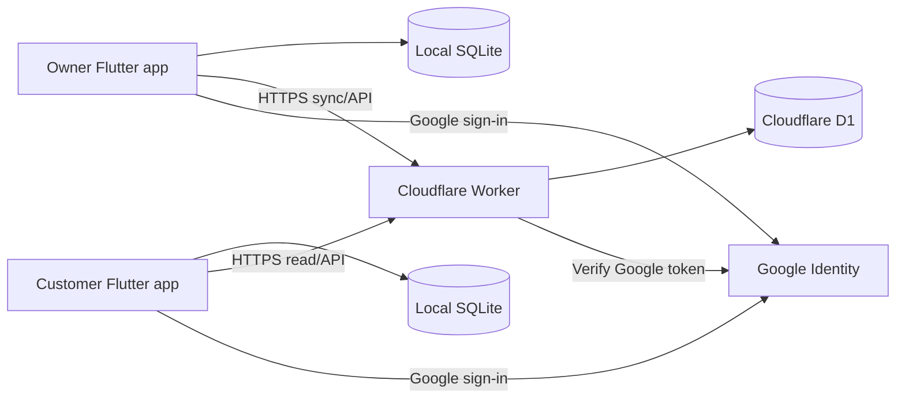

# Udhaar Khata — Software Engineering Specification

<!-- DOC_NAV_START -->
> **Document map:** [Document map](DOCUMENT-MAP.md). **Read with:** [SRS](SRS.md) · [HLD](HLD.md) · [LLD](LLD.md) · [Database design](DATABASE-DESIGN-ERD.md) · [API specification](API-SPECIFICATION.md).
<!-- DOC_NAV_END -->

**Version:** 1.0 draft  
**Date:** 29 September 2026  
**Requirements source:** [BRD.md](BRD.md)  
**Status:** Design specification; D02 shells and request pipeline implemented locally; ledger/identity features and deployment remain planned

## 1. System overview

The Android app is built with Flutter/Dart. It keeps a local SQLite database so the owner can record entries for previously linked customers offline, and customers can read their last synced history offline. A Cloudflare Worker owns authentication, authorization, validation, sync, and all D1 access. D1 is the authoritative source for transactions acknowledged by the server.

No API key or D1 credential is embedded in the mobile app. The Worker is the only D1 client. The app has separate local state for pending writes, server-acknowledged records, and the last successful sync time.

## 2. Technical choices and boundaries

| Concern | Choice |
|---|---|
| Mobile | Flutter Android, Dart; supported Android versions and package versions pinned during phase 0 |
| Local persistence | SQLite through a maintained Flutter package; migrations versioned and tested |
| Cloud API | Cloudflare Worker using TypeScript, strict runtime request validation, structured error responses |
| Database | Cloudflare D1, SQL migrations, prepared statements and scoped indexes |
| Authentication | Google OpenID Connect sign-in; Worker verifies Google ID token signature, issuer, audience, expiry, and subject, then issues a short-lived app session and revocable refresh credential |
| Authorization | Worker checks role, shop ownership, customer identity, and shop/customer link on every operation |
| API style | HTTPS JSON, `/v1`; pagination and idempotency for mutations |
| Money/time | Integer paise; UTC timestamps with local display; optional business date and due date |
| QR | Versioned payload with random, unguessable public customer identifier; no PII or auth credential |

The client can queue owner mutations while offline only after a prior authenticated session has established shop ownership and the customer link locally. The server always rechecks permissions when sync resumes. A device may display its cached data offline after token expiry, but cannot claim new cloud access until reauthentication.

## 3. Identity, QR, and authorization

### 3.1 Registration

Google's stable `sub` claim, scoped to the configured OAuth client/audience, identifies an account. The Worker upserts an internal `user_id` and associates it with the Google subject. Email can change and must not be used as a primary key. Owner creates exactly one shop in v1. Customer registration creates one random public QR identifier, distinct from `user_id` and the Google subject.

### 3.2 QR payload and scanning

Proposed payload: `udhaar://customer/v1/<random-public-id>`. Use at least 128 bits from a cryptographically secure random source and validate exact format and length. The identifier is a lookup value, not a login token or permission grant. The customer may save/display the QR offline after registration; rotating it or blocking a compromised QR is supported by issuing a new identifier and invalidating the old one online.

On scan, the app first checks its local cache for a linked identifier. If found, it can open that ledger offline. If not found, it must call the Worker to resolve the identifier; while offline, it shows **Internet needed to add this customer**. The Worker returns only the minimum profile needed for owner confirmation and enforces rate limits against enumeration. Linking requires an authenticated owner and is unique for that shop/customer pair. A repeat scan returns the existing link.

The amount form always shows the linked customer's display label and QR profile label before final submission. The owner is responsible for confirming the person at the counter; a copied QR screenshot can be presented by someone else. QR possession never allows viewing a ledger or writing a transaction by itself.

### 3.3 Access matrix

| Action | Owner of shop | Linked customer | Other user |
|---|---:|---:|---:|
| View shop summary/all customer ledgers | Yes | No | No |
| View one customer's entries in that shop | Yes | Own ledger only | No |
| Link customer QR to shop | Yes, online | No | No |
| Post credit/payment/correction | Yes | No | No |
| Report dispute | See/respond | Own entry only | No |
| Export shop data | Yes | Own statement only, if shared/view enabled | No |
| Remove customer's app access | Manage relationship subject to retention policy | Request/remove own viewing relationship | No |

Authorization uses internal IDs resolved from the authenticated session, never client-supplied role or ownership fields. Each data query includes the shop and subject scope. Admin access is isolated from the public API and audited.

## 4. Data model

Names and columns below are the planned logical schema. SQL migration files will define exact constraints and indexes in phase 0.

| Table | Main fields | Constraints and purpose |
|---|---|---|
| `users` | `id`, `google_sub`, `display_name`, `email`, `created_at`, `deleted_at` | Unique `google_sub`; email informational; no financial data in profile. |
| `customer_qr_ids` | `public_id`, `customer_user_id`, `status`, `created_at`, `revoked_at` | Unique opaque ID; active/revoked status; customer can rotate. |
| `shops` | `id`, `owner_user_id`, `name`, `created_at`, `status` | One active shop per owner in v1; unique owner constraint. |
| `shop_customers` | `id`, `shop_id`, `customer_user_id`, `shop_nickname`, `linked_at`, `status` | Unique `(shop_id, customer_user_id)`; customers can belong to many shops. |
| `ledger_entries` | `id`, `shop_id`, `customer_user_id`, `kind`, `amount_paise`, `note`, `payment_method`, `due_date`, `created_by`, `occurred_at`, `created_at`, `corrects_entry_id`, `client_operation_id`, `device_id` | Immutable posted entries; unique `(shop_id, client_operation_id)`; indexed by shop/customer/time. `kind` defines signed balance effect. |
| `disputes` | `id`, `entry_id`, `customer_user_id`, `reason`, `status`, `owner_note`, timestamps | Unique or rate limited active dispute per entry; no implicit balance change. |
| `sync_operations` | `shop_id`, `client_operation_id`, `entry_id`, `outcome`, `created_at` | Idempotency/response replay for retries, subject to retention design. |
| `refresh_sessions` | `id`, `user_id`, `device_id`, `token_hash`, `expires_at`, `revoked_at` | Store only hashed refresh credentials; revoke on sign-out/deletion. |
| `data_requests` | `id`, `requester_user_id`, `scope`, `status`, timestamps | Track export/deletion workflow and resolution. |

`ledger_entries` uses positive `amount_paise` for the entered magnitude. A credit sale has a positive balance effect; a payment has a negative effect; a correction has an explicit signed effect and references the entry it fixes. To prevent accidental double correction, the correction workflow validates the original and records a reason. Balances are calculated from committed entries or from a server-maintained projection whose value is reconciled against entries. The immutable ledger is the source of truth.

Use database constraints for positive entered amounts, valid kinds, references, uniqueness, and valid state transitions. Design indexes for `(shop_id, customer_user_id, created_at, id)`, owner shop lookup, customer linked shops, QR lookup, and operation IDs. Verify D1 row-read/write effects with realistic query plans; unnecessary indexes increase write counts and storage.

D03 adds hashed opaque `access_sessions` linked to refresh sessions, immutable ledger/receipt SQL triggers, and account-isolated sqflite with atomic entry/outbox and page/cursor adapters. The exact executable schema and storage ceilings are in [Database Design / ERD](DATABASE-DESIGN-ERD.md); identity issuance and public domain routes are later phases.

### Data lifecycle

Owner export includes shop, customer mapping, entries, and correction history in a machine-readable format; PDF/CSV are convenience reports, not the sole backup. A deletion request must distinguish account access removal, shop data deletion, and ledger retention needed for legitimate records or disputes. Publish the actual period after legal/privacy review. A customer removing app access must not silently erase the owner's historical entries. Re-enrollment must not expose a previous ledger without identity verification.

## 5. API contract sketch

Every endpoint returns a stable error code, message key, and request ID. Mutations accept an `Idempotency-Key` or `client_operation_id`; the Worker validates size, types, currency, role, and authorization. Never trust a supplied balance.

| Method/path | Caller | Purpose |
|---|---|---|
| `POST /v1/auth/google` | Signed-in device | Exchange verified Google ID token for app session; create/find user. |
| `POST /v1/auth/refresh`, `POST /v1/auth/logout` | Device | Rotate/revoke refresh session. |
| `GET /v1/me` | Either | Profile, role, shop/customer links, feature/schema versions. |
| `POST /v1/shops`, `GET /v1/shops/:id` | Owner | Create/read the owner's one shop. |
| `GET /v1/me/qr`, `POST /v1/me/qr/rotate` | Customer | Read or rotate own public QR identifier. |
| `POST /v1/customer-qr/resolve` | Owner | Resolve QR from a validated JSON body with minimum profile data; rate limited; requires online. Keep the public ID out of URL logs. |
| `POST /v1/shops/:shopId/customers` | Owner | Link resolved customer; duplicate returns existing link. |
| `GET /v1/shops/:shopId/customers` | Owner | Paginated list and balances. |
| `POST /v1/shops/:shopId/entries` | Owner | Post credit/payment/correction; idempotent. |
| `GET /v1/shops/:shopId/entries` | Owner | Scoped, paginated history/sync. |
| `GET /v1/me/ledgers`, `GET /v1/me/ledgers/:shopId/entries` | Customer | Own shops, balances and entries only. |
| `POST /v1/me/disputes` | Customer | Dispute an entry visible to that customer. |
| `PATCH /v1/shops/:shopId/disputes/:id` | Owner | Resolve dispute with status and note. |
| `POST /v1/shops/:shopId/export`, `POST /v1/me/deletion-requests` | Authorized user | Scoped export/deletion workflow; details fixed in implementation. |

Do not use a general `customerId` URL to grant customer access. Customer endpoints derive identity from the session. Owner endpoints verify shop ownership before any row query. Pagination uses an opaque cursor containing server ordering information; maximum page size is enforced. API version changes preserve older clients for a defined support window.

## 6. Offline and sync protocol

### Local state

SQLite stores authenticated user's scoped cache, linked customer QR IDs, ledger entries, pending operations, sync cursor, and last successful sync time. Device storage protection uses Android encryption facilities; session credentials use secure platform storage. Local records are isolated per signed-in Google account; sign-out clears sensitive caches after any pending unsynced operations are handled or explicitly exported.

### Owner write path

1. Validate amount in paise, customer link, and required fields locally.
2. Generate a UUID/ULID `client_operation_id` and immutable local entry ID before committing to SQLite.
3. In one local transaction, append ledger entry and outbox operation. Update local balance projection from the entry.
4. Show **Waiting to sync**. Retry with backoff when online; send the same operation ID on every retry.
5. Worker authenticates, authorizes, validates, and inserts through a D1 transaction/batch with the unique operation ID. Duplicate request returns the original committed result.
6. Client marks the entry **Synced** only after server acknowledgment and reconciles server time/ID. Permanent validation or permission failures show **Needs attention** and retain the local record for user action.

The protocol handles loss of the response after server commit: retrying the same operation yields the original result. Sync requests are bounded in size. The client does not overwrite server entries based on "latest update wins". Correction and dispute are new records/events.

### Pull path and conflicts

Pull ordered server changes by scoped cursor. Customer sees only their own shop ledgers. Reconcile by immutable entry/operation ID; never use device clock alone for conflict decisions. If the owner loses access, pending writes are rejected and retained locally for recovery/export rather than silently posted. If a QR rotates, a linked customer continues to be identified by internal user ID; stale QR scans must be handled with clear error/refresh behavior.

### Recovery boundary

Cloud-acknowledged entries are restorable on a replacement phone. Local Pending entries on a lost device are not recoverable from D1. The UI must show this distinction. An owner export includes a snapshot and its generation time. Test app upgrades and failed migrations against a copy of local data.

## 7. Screen map and UX states

**Owner:** Sign in → Shop setup → Home summary → Scan QR → (New customer confirmation or linked customer) → Credit amount and confirmation → Receipt/status → Customer ledger. From customer ledger: payment, correction, due date, statement, reminder, dispute list.

**Customer:** Sign in → My QR → My shops → Shop balance/history → Entry detail → Report dispute. Show last successful sync on balance/history screens and explain pending updates.

**Required states:** loading, empty, offline cached, first scan needs internet, expired login, permission revoked, duplicate submit, QR invalid/revoked, pending sync, retryable failure, permanent failure, export/deletion pending, and quota/service unavailable. Balance direction must use text as well as color: **You owe shop ₹X** for customer and **Customer owes you ₹X** for owner.

The QR scan should not post automatically: it opens amount entry, and the owner reviews customer and amount before tapping Submit. This preserves the requested quick counter flow while preventing accidental charges from scan errors.

## 8. Security, privacy, and abuse controls

- Verify Google ID tokens against trusted Google keys and all required claims on the Worker. Never accept unverified client profile fields as identity. Use short-lived access sessions and rotated, revocable refresh credentials.
- Restrict D1 binding to Worker code. Validate JSON schemas at the API boundary. Use prepared SQL statements; do not interpolate user data into SQL.
- Apply rate limits to QR lookup, sign-in, dispute, and export endpoints. Restrict QR lookup results to minimum display identity; prevent bulk enumeration. A random QR ID reduces guessing but does not make lookup safe without rate limits.
- Scope every ledger read and write to authenticated shop ownership or authenticated customer identity. Test cross-shop and cross-customer cases. Avoid data leakage through error messages, logs, exports, and pagination cursors.
- Require owner confirmation before posting a charge. Keep correction reasons and history; surface disputes to both sides. Flag unusually high amounts or repeated rapid posts for review without blocking legitimate shop activity by default.
- Cache financial data securely on device; exclude sensitive data from crash reports. Clear caches on account switch. Avoid collecting contacts, location, or phone number in v1.
- Configure production/test D1 separately; restrict operator access; keep migration and deployment credentials outside source control. Audit administrative exports/deletions.
- Produce a privacy notice and retention/deletion policy reviewed for the launch jurisdiction before public release. Do not claim a statutory retention period without review.

## 9. Performance, quota, and operations

Cloudflare's published Workers Free D1 allowances at document creation are 5 GB total storage, 5 million rows read/day, and 100,000 rows written/day. Index writes count toward rows written. Cloudflare says D1 free-plan reads/writes stop when the daily limit is reached, and further writes stop when storage is full. Workers have separate free usage limits. Recheck current limits before pilot and launch.

Engineering practices:

- Paginate history and sync in bounded pages; index scoped queries; avoid full table scans and repeated summary recomputation on every home load.
- Record per-route request counts, D1 rows read/written, storage, latency, error rates, QR link failures, sync queue age, and duplicate-operation hits. Do not log transaction notes or Google tokens.
- Set warning thresholds at 50%, 75%, and 90% of daily free allowances and at 70%/85% of storage. These are initial operational triggers, adjustable after pilot.
- If quota errors occur, owner local writes for previously linked customers remain queued and visibly pending. Cloud reads fall back to clearly dated cache. New QR links are unavailable. Never report an unsynced entry as safely backed up.
- Keep periodic encrypted D1 export/restore procedures and test restoration in a separate environment. Cloudflare D1 backup/Time Travel capabilities and limits must be checked against the active plan before relying on them. A user's CSV/PDF is an export, not a full operational database backup.
- Separate staging and production, use versioned migrations with rollback/recovery plan, and monitor Workers/D1 and app crashes during pilot.

## 10. Quality strategy and phase acceptance

| Phase | Engineering work | Required evidence |
|---|---|---|
| 0 | Project skeleton, CI, test/staging environments, Google sign-in, Worker authorization, D1 migrations, local schema | Token validation tests; unauthorized shop/customer requests denied; migration up/down or recovery exercise. |
| 1 | QR identity, online linking, credit/payment ledger, balance and history | One QR links only once per shop; same request posted twice creates one entry; money arithmetic exact in paise; cross-shop isolation tests. |
| 2 | Offline SQLite outbox, sync, customer views, correction/disputes | Airplane-mode repeat scan/post; reconnect after lost acknowledgment; no duplicate charge; customer cannot see another customer; correction preserves original; failed sync visible. |
| 3 | Due dates, reminders, PDF/CSV, Hindi, export/deletion UX | Export balances reconcile to ledger; Hindi/English critical flows checked; accessibility pass; deletion workflow rehearsed. |
| 4 | Private test, shop pilot, security/performance review, release preparation | Restore drill, realistic data load within quota, crash/sync metrics reviewed, pilot acceptance goals in BRD met. |

Automated tests should focus on money arithmetic, idempotency, authorization, account switching, QR linkage, offline recovery, schema migrations, and customer privacy. Run manual device tests on low-end Android hardware, intermittent network, and camera permission denial. Test the real Google sign-in configuration and release signing in a nonproduction environment before public launch.

## 11. Decisions reserved for implementation or launch review

- Exact Flutter packages, Android minimum version, app signing, Google OAuth configuration, and Worker framework are selected and pinned in phase 0 using current official documentation.
- Define a published retention/deletion period with jurisdiction-specific legal review before launch. The app must support request tracking now, without inventing a statutory rule.
- Decide whether a shop can remove a customer link and how prior ledgers remain accessible in the presence of disputes, export requests, or legal retention.
- Define a maximum amount per transaction and rate limits from pilot fraud/abuse data. Always use integer paise and reject zero or negative input magnitudes.
- Choose periodic operational backup destination and encryption key ownership before live financial records are accepted. Test restoration.
- Monitor free-tier quotas and decide a business response before scaling beyond them; the product cannot promise unlimited free storage.

## 12. Source references

- [Cloudflare D1 pricing, quotas, and quota exhaustion behavior](https://developers.cloudflare.com/d1/platform/pricing/)
- [Cloudflare D1 Worker binding API](https://developers.cloudflare.com/d1/worker-api/)
- [Cloudflare Workers pricing](https://developers.cloudflare.com/workers/platform/pricing/)
- [Google OpenID Connect](https://developers.google.com/identity/openid-connect/openid-connect)
- [Flutter Android documentation](https://docs.flutter.dev/platform-integration/android)

This document specifies the intended behavior. Provider limits and API details should be verified again when each phase starts.

### D04 implementation checkpoint

Local auth verifies Google identity using trusted JWKS, maps immutable subject and role, issues hashed 15-minute opaque access credentials and rotating refresh credentials capped at 30 days from initial issue, and revokes the session on spent-token replay/logout. Android secure storage and role selection/sign-out are wired; Pending records stay account-isolated and locked on sign-out. See the API session policy, security requirements and implementation progress for checks and limits. Live Google configuration, device evidence and deployment remain pending; this is not a public-release claim.

### D06 implementation checkpoint

Customer QR uses exactly `udhaar://customer/v1/{publicId}` with a 256-bit random lowercase hex lookup ID and no personal, financial or credential fields. Own-QR read and online rotation enforce the customer session. Rotation revokes the old mapping atomically, preserves internal links and permits at most three attempts per customer per ten minutes. The customer screen renders a readable QR with account label and explains that it does not authorize payment. Account-specific secure-storage cache labels saved codes as unverified; uncertain rotation persists a recovery marker and hides the old code until online confirmation. Offline presentation works in an already verified open session, even if an attempted auth renewal fails: credentials are discarded and the account database is locked, while only the cached public QR remains with a Sign in again action. This confers no cloud or ledger authorization. Failed rotations retain an explicit failure notice after recovering the current QR. Full offline session restoration after cold startup remains D12. D07 owner resolution/linking and physical-device QR scanning remain separate gates. Synthetic authorization/rotation/cache/UI and independent rendered-image decoding evidence is recorded in implementation progress.

### D07 implementation checkpoint

Owner scanning accepts only the bounded exact `udhaar://customer/v1/{publicId}` format, requests camera permission only on scan, and provides permission retry/settings and invalid/version/revoked/internet-needed states. An online lookup authorizes the shop before displaying minimal customer identity and makes no link or financial change. Explicit Add customer creates one active relationship using an atomic, scoped D1 batch and operation receipt; same-ID/body retries replay, changed bodies conflict, and concurrent different IDs for the same shop/customer return the existing link. Live QR/ownership/customer predicates are checked at commit. Removed access is not restored by scanning. Original confirmed command bodies are saved in account/shop-specific secure storage before POST and retained after response loss/restart; new scans cannot replace an unresolved confirmation. The bounded customer list states overflow and returning customers open an authorized ledger screen. Credit/payment/history and complete pagination remain D08-D10; owner offline cache/sync remain later gates. Physical camera/device and remote D07 deployment evidence are recorded separately in implementation progress.

### D08 online credit implementation contract (2026-10-01)

Approved pilot limits v1: positive credit ₹0.01–₹1,00,000.00 (1–10,000,000 integer paise), optional trimmed note up to 500 UTF-16 code units, valid optional YYYY-MM-DD due date, financial JSON body at most 4,096 bytes, and existing first-100 list ceiling. General JSON/auth bodies retain the 65,536-byte ceiling. The Worker validates strict credit fields and canonical UUID v4 operation identity; unknown/forged effect fields and payment/correction variants are rejected in D08. A first online command accepts device occurrence time from 24 hours before server time to 5 minutes ahead. Receipt replay precedes this mutable clock check. Payments, corrections, full history/pagination and offline local ledger remain their later phases.

The owner opens a linked customer, enters amount/note/date, reviews customer identity and the explicit Customer owes you direction, then confirms. Review has no financial effect. The app durably saves an account/shop/link-specific command before POST and never generates a replacement ID after uncertainty. Reopening the form recovers that body with Check same credit; a response must match shop, link, type, amount/effect, note/date, occurrence time and sequence before acknowledgement. Unverified responses, storage failures, auth/network failure and rejected requests retain the saved record for recovery; it is not silently discarded. This online recovery record is not the D11 offline ledger/outbox, and does not provisionally change the visible balance.

The Worker uses the existing immutable ledger triggers and atomic entry-plus-receipt batch; live authorization is rechecked at commit and replay requires current access. Receipt retries return the original committed balance/version even after later entries, explicitly labeled as the balance when this credit was recorded. Owner link/list reads refresh the current balance. Customer My shops receives its own active link balances/versions from the same profile query and can refresh them. New minimal balance reads authorize the entire current snapshot in one SQL query; no history page or aggregate overdue total is inferred. No new migration is needed.
