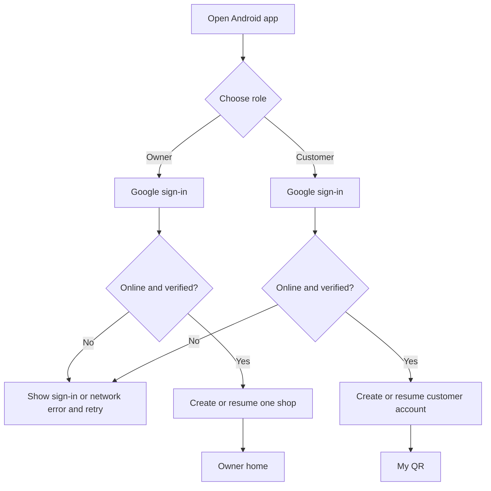
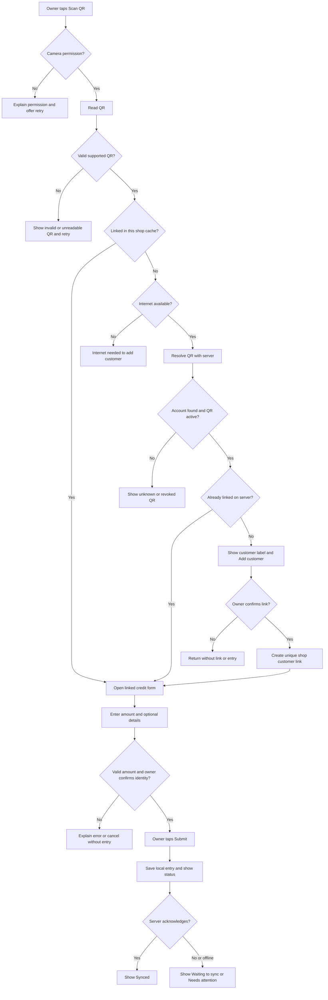
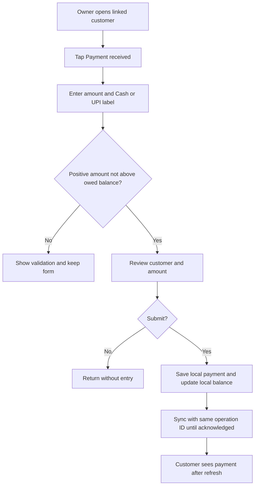
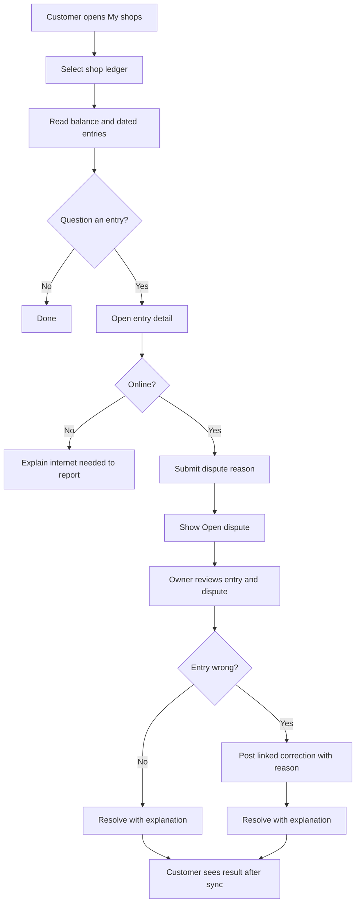
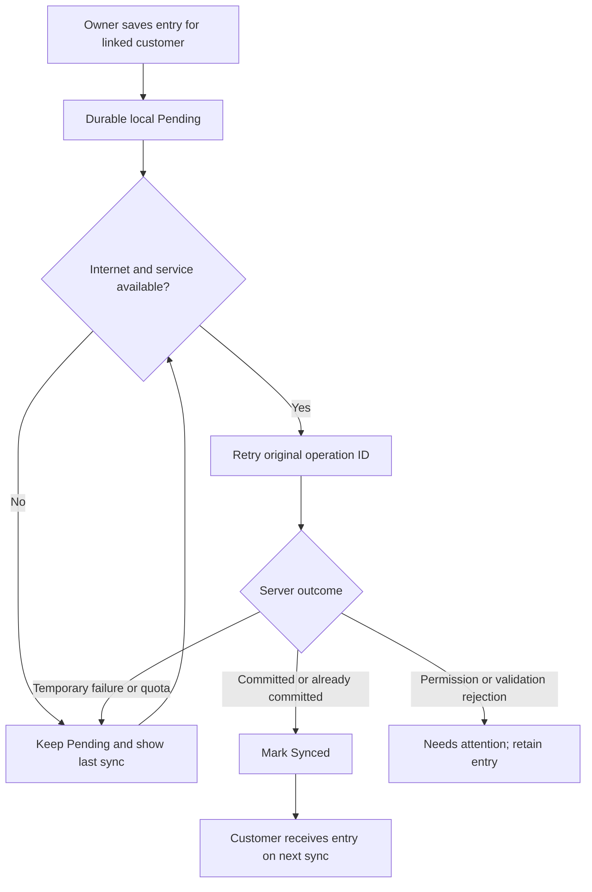

# Udhaar Khata — User Journey and User Flow

<!-- DOC_NAV_START -->
> **Document map:** [Document map](DOCUMENT-MAP.md). **Read with:** [Personas](USER-PERSONAS.md) · [Use cases and stories](USE-CASES-USER-STORIES.md) · [PRD](PRD.md) · [Wireframes](WIREFRAMES.md).
<!-- DOC_NAV_END -->

**Version:** 1.0 draft  
**Date:** 29 September 2026  
**Release:** Android v1  
**Related:** [Personas](USER-PERSONAS.md) · [PRD](PRD.md) · [SRS](SRS.md) · [Scope](SCOPE.md)

## 1. Purpose and reading guide

The **journey** shows what the shopkeeper and customer are trying to accomplish across visits. The **flows** show app screens, decisions and error paths. These are planned interactions, not observations from completed field research. The [Project Plan](PROJECT-PLAN-ROADMAP.md) calls for prototype and shop-pilot validation.

Flow notation: **Owner** and **Customer** are separate signed-in users. **Local save** means data exists on the owner's phone; **Server acknowledged** means the Worker committed it to D1. The QR identifies the customer account but is not payment or charge authorization. Each transition that writes a credit entry requires the owner to review identity and amount and tap Submit.

## 2. End-to-end journey map

| Stage | Customer action and expectation | Shop owner action and expectation | Product touchpoint / state | Risk and experience requirement |
|---|---|---|---|---|
| 1. Discover | Hears about the app from a shop; decides whether another app is worthwhile | Decides whether it will speed the counter and preserve records | Explanation, onboarding | Mandatory customer install/Google account may cause refusal. Explain value honestly and record refusal in pilot. |
| 2. Set up | Signs in with Google, sees display label and personal QR | Signs in with Google and names one shop | Customer QR; shop setup | Both need internet for first registration. QR must not expose contact or financial data. |
| 3. First visit | Presents QR and wants the right account linked | Scans while online, confirms displayed person, taps Add customer | QR scanner → new customer → amount form | Unknown QR cannot be verified offline. Same customer must not be added twice. |
| 4. Credit sale | Sees owner finish quickly; later expects entry to appear | Enters amount, reviews customer and amount, submits | Amount form → local receipt → sync status | Local save may precede cloud acknowledgment. No accidental charge from scanning alone. |
| 5. Repeat visit | Opens existing QR, possibly without internet | Scans linked QR and records credit or payment | Scanner → linked ledger/form | Linked lookup and owner entry should work offline. Retry must not create a second charge. |
| 6. Review and settle | Opens each shop's history and pays some or all of what is owed | Checks balance, records payment manually, can share reminder/statement | Customer ledger; owner ledger; share sheet | Customer sees only own entries. Cash/UPI label is manual, not proof of payment. |
| 7. Correct or dispute | Flags an entry and watches status | Reviews dispute and, if needed, posts correction with reason | Entry detail → dispute/correction | Dispute does not change balance; original history remains visible. |
| 8. Recover | Signs in on a replacement phone to see acknowledged history | Restores acknowledged shop records; checks last sync | Sign-in → cloud restore | Pending entries on lost phone cannot be recovered from D1. Explain this before a loss occurs. |

The intended positive outcome is a fast, explainable credit record. The most important negative outcomes to prevent are wrong-customer charges, duplicate entries, silent loss of offline data, and exposing one customer's ledger to another.

## 3. Navigation model

| Role | Primary destinations | Secondary destinations |
|---|---|---|
| Owner | Home summary, Scan QR, Customer list, Customer ledger | Credit/payment form, correction, dispute list, reminder preview, statement/export, settings/help |
| Customer | My QR, My shops, Shop ledger | Entry detail, report dispute, settings/help |

An owner can reach an existing customer from a scan or their customer list. The QR scan is the default counter path. A customer can open their QR immediately after sign-in and can switch among linked shops without seeing another customer's data.

## 4. Flow F1 — first-time account setup

**Owner:** Shop name is required. A returning owner goes directly to their existing shop. A second active shop cannot be created in v1.  
**Customer:** Registration creates a QR lookup identifier. A returning customer can open the already issued QR from local storage while offline, but initial sign-in/registration needs internet.  
**Failure behavior:** Cancelling Google sign-in leaves the user on the welcome screen. A different Google account must not see the previous account's cached ledger.

## 5. Flow F2 — scan, link and record credit

**First visit:** New QR lookup and link creation require internet. The owner may add a shop nickname after confirming the customer, then continues to amount entry.  
**Repeat visit:** A verified cached link lets the owner open the form offline. Server authorization is checked again on sync.  
**Credit validation:** Amount must be positive INR within the configured maximum. A scan alone never posts. A repeated tap or retry uses the same operation identity and must result in one entry.  
**Customer visibility:** The customer sees a new entry after the server acknowledges it and their app syncs. A merely local owner entry is not presented as already shared.

## 6. Flow F3 — payment received

An owner can find the linked customer by scanning or from the customer list. The balance example is ₹500 credit followed by ₹200 payment, leaving ₹300 owed. Cash/UPI is a manually entered method label. An offline payment that later conflicts with a changed server balance must stay visible as **Needs attention** for review, not be silently discarded or turned into an advance.

## 7. Flow F4 — customer review, dispute and owner correction

The customer's cached history remains readable offline with a last-sync label. A dispute needs internet in v1. Filing or resolving it does not alter the ledger amount. A correction is a separate entry, leaves the original visible, and changes balance by its signed effect. Customer permissions do not allow editing or deleting shop entries.

## 8. Flow F5 — reminder, statement and export

| Step | Owner action | System response |
|---|---|---|
| 1 | Open linked customer's ledger | Show current known balance, entry history and last sync state. |
| 2A | Choose **Share reminder** | Prepare polite message with shop, customer and balance; owner can review, edit, cancel or choose an Android share destination. |
| 2B | Choose **Statement** | Request customer/date range and generate PDF with opening balance, entries, corrections and closing balance. |
| 2C | Choose **Export CSV** | Generate scoped machine-readable records for the selected period. |
| 3 | Complete or cancel | No automatic message is sent; exported totals reconcile with ledger. |

If the owner's local balance includes Pending entries, the reminder or export must make that status clear. The owner should not unknowingly send a figure that the customer cannot yet see. The product team should validate exact wording in phase 3.

## 9. Flow F6 — network loss, quota error and new-phone recovery

**Loss of a response:** If the server committed but the phone did not receive the answer, retrying the same operation must return the original result, not a second charge.  
**Quota or outage:** Existing linked customers can continue to have local Pending entries; unknown QR linking remains unavailable. Pending is never described as backed up.  
**New phone:** Google sign-in restores server-acknowledged records. Any entries still only on a lost phone are absent; the UI explains the boundary. A restore drill must test one Synced and one Pending entry.

## 10. State and screen inventory

| State | Visible meaning | User action |
|---|---|---|
| Empty shop / no linked customer | No ledger yet | Scan a customer QR while online. |
| Customer has no linked shop | QR is ready, no shop has linked it yet | Present QR to shop owner. |
| Invalid QR | Code cannot be read or is not an Udhaar Khata code | Rescan; do not create entry. |
| Revoked QR | Identifier is no longer active for new links | Customer opens current QR after going online. |
| Unknown QR offline | Customer not in this shop's cache | Connect to internet and rescan. |
| Waiting to sync | Entry is saved on this phone only | Keep app/device; reconnect; check status. |
| Synced | Server acknowledged the entry | Customer can see it after their refresh. |
| Needs attention | Entry was not accepted or needs manual recovery | Review reason, retry where allowed, or seek support; entry remains local. |
| Stale customer history | Cached ledger may omit recent owner changes | Show last successful sync and refresh when online. |
| Dispute Open/Resolved | Issue reported / owner responded | Read status and correction history. |
| Account access removed | This user no longer has access to a shop ledger | Show help and account-linking guidance; do not expose cached data. |

## 11. Hand-offs and design checks

| Transition | Responsibility | Check before progressing |
|---|---|---|
| Customer QR → owner scan | Customer presents; owner confirms person | QR payload contains no personal/financial data; copied QR is not treated as consent. |
| Owner local save → server | App retains operation until acknowledged | Same ID on retry; authorization rechecked. |
| Server acknowledgment → customer view | Customer app refreshes | Customer sees only their own ledger; state and balance agree with server. |
| Dispute → correction | Customer reports; owner decides | Dispute alone does not alter balance; original entry stays visible. |
| Owner export/reminder → third-party app | Owner chooses share destination | No automatic send; user reviews amount and recipient. |

The flows should be exercised with [personas P1–P4](USER-PERSONAS.md) during prototype tests. Record where people pause, abandon onboarding, mistake Pending for Synced, scan the wrong QR, or cannot understand the balance. Update the [PRD](PRD.md) and [SRS](SRS.md) if observations require a behavior change.
